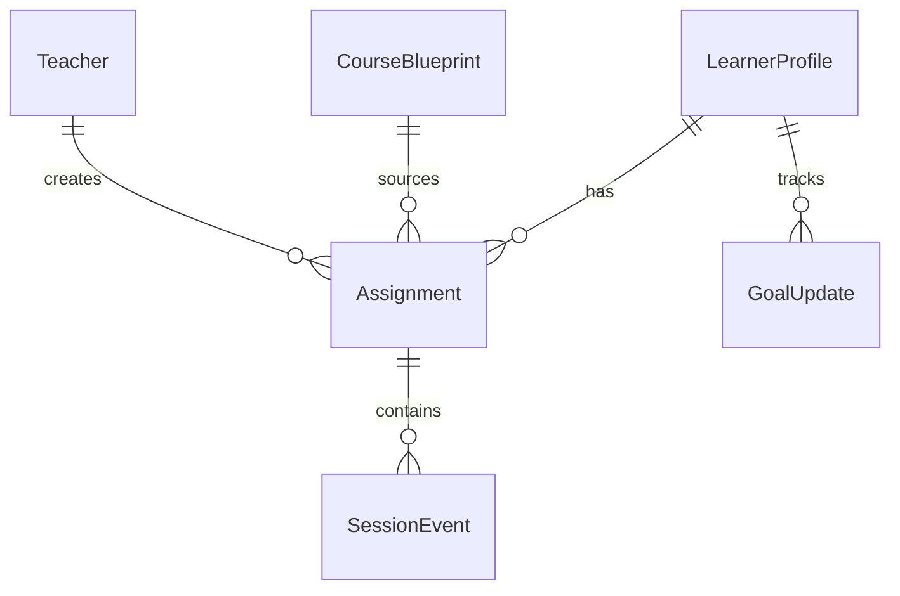
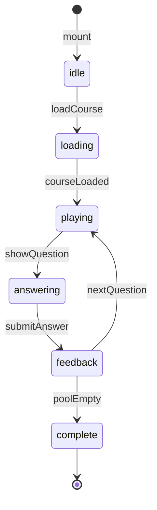

# LearnPlay Platform – Golden Plan

> **Version:** 5.0  
> **Generated from:** system-manifest.json  
> **Last Updated:** 2025-12-05

---

## A. Domain Definition

### A.1 Product Name
LearnPlay Platform

### A.2 Tagline
Adaptive learning with multi-role insights.

### A.3 Problem Statement
Students need personalized learning experiences that adapt to their skill level, while teachers and parents need visibility into progress without overwhelming dashboards. LearnPlay uses an adaptive algorithm to serve the right content at the right time, with role-specific views for all stakeholders.

### A.4 Target Users
| Persona | Description | Primary Goal |
|---------|-------------|--------------|
| Learner | K-12 student using the platform | Complete learning goals efficiently |
| Teacher | Instructor managing classes | Monitor student progress, assign work |
| Parent | Guardian tracking child progress | Stay informed on learning outcomes |
| Admin | Platform administrator | Manage system health, content |

### A.5 Key Features
1. Adaptive learning sessions with variant rotation
2. Multi-role dashboards (student, teacher, parent, admin)
3. AI-powered content generation and assignment planning
4. Progress tracking with goal management
5. Course catalog with guard validation

---

## B. Data Model

### B.1 Root Entities

| Entity | Slug | Description |
|--------|------|-------------|
| LearnerProfile | learner-profile | Student profile with goals and progress |
| Assignment | assignment | Learning task assigned to a student |
| CourseBlueprint | course-blueprint | Course content template |
| MessageThread | message-thread | Communication thread between users |
| JobTicket | job-ticket | AI job queue entry |

#### LearnerProfile Fields
| Field | Type | Required | Description |
|-------|------|----------|-------------|
| full_name | string | Yes | Student's display name |
| avatar_url | string | No | Profile image URL |
| grade_level | string | Yes | Current grade (e.g., "5th") |
| weekly_goal_minutes | number | Yes | Target study time per week |
| current_assignment_id | string | No | Active assignment reference |
| goal_status | string | No | on_track/behind/ahead |
| insights_snapshot | json | No | Cached analytics data |

#### Assignment Fields
| Field | Type | Required | Description |
|-------|------|----------|-------------|
| title | string | Yes | Assignment name |
| status | enum: draft/scheduled/in_progress/graded/archived | Yes | Current state |
| subject | string | Yes | Subject area |
| due_date | date | No | Deadline |
| adaptive_cluster_id | string | No | Linked content cluster |
| ai_variant_id | string | No | AI-selected variant |
| learner_id | string | Yes | Assigned student |
| teacher_id | string | Yes | Assigning teacher |
| rubric | json | No | Grading criteria |
| attachments | json | No | File references |

#### CourseBlueprint Fields
| Field | Type | Required | Description |
|-------|------|----------|-------------|
| title | string | Yes | Course name |
| subject | string | Yes | Subject area |
| difficulty | enum: elementary/middle/high/college | Yes | Target level |
| catalog_path | string | No | Storage path for content JSON |
| multimedia_manifest | json | No | Media asset references |
| guard_status | enum: pending/passed/failed | No | Validation state |
| published | boolean | No | Available to students |
| notes | string | No | Internal notes |

#### MessageThread Fields
| Field | Type | Required | Description |
|-------|------|----------|-------------|
| title | string | Yes | Thread subject |
| participant_ids | json | Yes | User IDs in thread |
| last_message | string | No | Preview text |
| unread_counts | json | No | Per-user unread counts |
| pinned | boolean | No | Sticky thread |

#### JobTicket Fields
| Field | Type | Required | Description |
|-------|------|----------|-------------|
| job_type | string | Yes | AI job identifier |
| status | enum: queued/running/completed/failed | Yes | Current state |
| payload | json | No | Input parameters |
| result | json | No | Output data |
| target_id | string | No | Entity being processed |

### B.2 Child Entities

| Entity | Slug | Parent | Description |
|--------|------|--------|-------------|
| SessionEvent | session-event | Assignment | Individual learning interaction |
| GoalUpdate | goal-update | LearnerProfile | Weekly goal adjustment |

#### SessionEvent Fields
| Field | Type | Required | Description |
|-------|------|----------|-------------|
| assignment_id | string | Yes | Parent assignment |
| question_ref | string | No | Item identifier |
| outcome | enum: correct/incorrect/skipped/hint | Yes | Result |
| duration_seconds | number | No | Time spent |
| transcript | string | No | Audio/text capture |
| confidence_score | number | No | AI confidence |

#### GoalUpdate Fields
| Field | Type | Required | Description |
|-------|------|----------|-------------|
| learner_id | string | Yes | Parent learner |
| week_of | date | Yes | Week starting date |
| target_minutes | number | Yes | Goal for this week |
| note | string | No | Reason for change |

### B.3 Relationships


---

## C. User Journeys

### C.1 Learner Journey: Complete a Learning Session

**Trigger:** Learner opens the app to study

**Steps:**
1. Open app → /student/dashboard → See current assignment and goal progress
2. Click "Continue Learning" → /play/welcome → See session intro
3. Start session → /play → Adaptive questions begin
4. Answer questions → /play → Immediate feedback, pool updates
5. Complete all items → /results → See score, accuracy, time
6. Return to dashboard → /student/dashboard → Updated goal progress

**Success Criteria:**
- [ ] Session completed with all items answered
- [ ] Score and time tracked
- [ ] Goal progress updated
- [ ] Session event logged

**Edge Cases:**
- If network disconnects: Auto-save progress, resume on reconnect
- If all answers wrong: Eventually complete via variant rotation
- If session abandoned: Save partial progress

### C.2 Teacher Journey: Create and Assign Work

**Trigger:** Teacher wants to assign practice to students

**Steps:**
1. Open dashboard → /teacher/dashboard → See class overview
2. Go to assignments → /teacher/assignments → View existing assignments
3. Create new → /teacher/control → Fill assignment form
4. Use AI assist → Click "Draft Plan" → AI suggests activities
5. Review and assign → Save → Assignment created for students
6. Monitor progress → /teacher/class-progress → See completion rates

**Success Criteria:**
- [ ] Assignment created with all required fields
- [ ] Students notified (if enabled)
- [ ] Progress trackable

**Edge Cases:**
- If AI assist fails: Show error, allow manual creation
- If no students in class: Show warning

### C.3 Parent Journey: Check Child Progress

**Trigger:** Parent wants to see how child is doing

**Steps:**
1. Open app → /parent/dashboard → See child's weekly summary
2. View goals → /parent/goals → See goal status and history
3. View subjects → /parent/subjects → See per-subject breakdown
4. View timeline → /parent/timeline → See recent activity

**Success Criteria:**
- [ ] Can see current week progress
- [ ] Can see subject breakdown
- [ ] Can see activity timeline

### C.4 Learner Journey: Join a Class

**Trigger:** Learner receives a class code

**Steps:**
1. /student/dashboard → open join flow
2. /student/join-class → enter class code → submit
3. Success → show confirmation → update roster and assignments

**Success Criteria:**
- [ ] Class code validated and learner added
- [ ] Dashboard reflects class + assignments

**Edge Cases:**
- Invalid/expired code → error toast
- Already in class → show info, no duplicate

### C.5 Learner Journey: Track Achievements & Assignments

**Trigger:** Learner reviews progress

**Steps:**
1. /student/assignments → view list (empty state supported)
2. /student/achievements → view badges/stats
3. /student/timeline → view recent activity

**Success Criteria:**
- [ ] Assignments load with status, empty state handled
- [ ] Achievements list renders without errors
- [ ] Timeline shows recent session events

**Edge Cases:**
- No assignments → empty state CTA
- Stale data/offline → show fallback, retry

### C.6 Messaging Journey (All Roles)

**Trigger:** Teacher/Parent/Student opens inbox

**Steps:**
1. Navigate to /messages → load threads
2. Open thread → view messages
3. Send message → optimistic append → confirm/send

**Success Criteria:**
- [ ] Threads load with unread counts
- [ ] Send succeeds or surfaces error
- [ ] Threads update without duplicate sends

**Edge Cases:**
- Network failure → toast + retry
- Empty inbox → empty state

### C.7 Teacher Journey: Progress & Analytics

**Trigger:** Teacher checks class/assignment performance

**Steps:**
1. /teacher/dashboard → overview
2. /teacher/class-progress → class-level metrics
3. /teacher/assignment-progress → per-assignment detail
4. /teacher/analytics → deeper analytics (trends)

**Success Criteria:**
- [ ] Progress cards render with real data
- [ ] Empty/no-data states handled
- [ ] Navigation between analytics views works

**Edge Cases:**
- No students/assignments → informative empty states
- Slow queries → loading indicators

### C.8 Parent Journey: Subjects & Timeline (Edge Cases)

**Trigger:** Parent reviews a child’s progress

**Steps:**
1. /parent/dashboard → weekly summary
2. /parent/subjects → subject breakdown
3. /parent/timeline → activity timeline

**Success Criteria:**
- [ ] Handles no-linked-child with guidance to link
- [ ] Subject breakdown shows per-subject progress
- [ ] Timeline reflects recent events

**Edge Cases:**
- Missing child link → prompt/link flow
- Stale data → retry surfaced

### C.9 Admin Journey: System Operations

**Trigger:** Admin validates system health and jobs

**Steps:**
1. /admin/console → overview
2. /admin/system-health → service checks
3. /admin/ai-pipeline → pipeline status
4. /admin/jobs → queue state

**Success Criteria:**
- [ ] Health surfaces pass/fail clearly
- [ ] Jobs list with status/filters
- [ ] Errors surfaced, not hidden

**Edge Cases:**
- No jobs → empty state
- Failed job → visible error/detail

### C.10 Admin Journey: Deployment Verification

**Trigger:** Admin validates a fresh deploy

**Steps:**
1. /admin/system-health → check services (Supabase, MCP, edge)
2. /admin/ai-pipeline → confirm pipeline idle/healthy
3. /admin/jobs → ensure no failed jobs; retry if needed
4. /catalog-builder → run guard_course on a sample blueprint
5. /play (smoke) → start/finish a session to confirm live paths

**Success Criteria:**
- [ ] Health page shows all green or surfaced failures
- [ ] Jobs queue has no stuck failed jobs
- [ ] Guard job completes
- [ ] Play session completes end-to-end

**Edge Cases:**
- 401/403 from edge: verify AGENT_TOKEN/user auth headers
- Missing AI keys: surface BLOCKED, do not mock success

---

## D. UI Surfaces

### D.1 Route Map

| Route | Page Name | Persona | States |
|-------|-----------|---------|--------|
| / | Landing | All | default |
| /auth | Authentication | All | default |
| /student/dashboard | Student Dashboard | Learner | default, loading, empty, offline |
| /student/achievements | Achievements | Learner | default |
| /student/assignments | Assignment List | Learner | default, empty |
| /student/goals | Goal Management | Learner | default |
| /student/join-class | Join Class | Learner | default, error |
| /student/timeline | Activity Timeline | Learner | default |
| /play | Play Session | Learner | default, loading, error |
| /play/welcome | Session Welcome | Learner | default |
| /results | Session Results | Learner | default |
| /teacher/dashboard | Teacher Dashboard | Teacher | default, loading |
| /teacher/control | Control Panel | Teacher | default, job-running |
| /teacher/classes | Class List | Teacher | default |
| /teacher/students | Student Roster | Teacher | default |
| /teacher/assignments | Assignment Manager | Teacher | default |
| /teacher/analytics | Analytics | Teacher | default |
| /teacher/class-progress | Class Progress | Teacher | default |
| /teacher/assignment-progress | Assignment Progress | Teacher | default |
| /parent/dashboard | Parent Dashboard | Parent | default, empty |
| /parent/goals | Goal Tracking | Parent | default |
| /parent/subjects | Subject Progress | Parent | default |
| /parent/timeline | Activity Timeline | Parent | default |
| /messages | Messages Inbox | All | default, empty |
| /admin/console | Admin Console | Admin | default |
| /admin/system-health | System Health | Admin | default |
| /admin/ai-pipeline | AI Pipeline | Admin | default |
| /admin/jobs | Job Queue | Admin | default, empty |
| /catalog-builder | Course Builder | Admin | default, guard-blocked |
| /settings | Settings | All | default, saved, error |

### D.2 Page Specifications

See `mockups/` for detailed HTML mockups with:
- `data-route` attributes for routing
- `data-cta-id` attributes for CTAs
- `data-field` attributes for data binding
- `data-action` attributes (navigate/save/enqueueJob)
- Coverage: 30 HTML mockups compiled to 30 generated pages and routes

**CTA / Behavior Notes (per key page)**
- Landing: `get-started` → /auth; `learn-more` → /about
- Auth: email/password submit; role select routes to role dashboards
- Student Dashboard: `continue-learning` → /play/welcome; cards → assignments/achievements/goals; settings icon → /settings
- Student Assignments: `continue-assignment` → /play; empty state supported
- Student Achievements/Timeline: back CTA to dashboard
- Student Join Class: `join-class` save; validation errors surfaced
- Play Welcome: level select (1–5, lock >3); start → /play; back → dashboard
- Play Session: submit answer (local check), feedback, progress bar, exit → dashboard
- Results: `play-again` → /play/welcome; back → dashboard
- Teacher Dashboard: quick actions → control/classes/analytics
- Teacher Control: `draft-plan` enqueue `draft_assignment_plan`; `save-assignment` save
- Teacher Classes/Students: navigate to progress/roster
- Teacher Class Progress / Assignment Progress / Analytics: back CTA; message/inspect actions
- Parent Dashboard: nav to goals/subjects/timeline
- Parent Goals: `adjust-goal` save; encouragement navigate
- Messages: threads load; `send-message` save; `new-message` navigate
- Admin Console: nav to health/jobs/ai-pipeline
- Admin Health: refresh UI action; back
- Admin AI Pipeline: new/cancel job CTA
- Admin Jobs: view job; retry job enqueue
- Catalog Builder: `new-course`/`save-course` save; `ai-generate` (ai_course_generate); `guard-course` (guard_course)
- Settings: `save-settings` save; cancel → back

---

## E. AI Jobs & Prompts

### E.1 Job Registry

| Job ID | Target Entity | Mode | Trigger |
|--------|---------------|------|---------|
| draft_assignment_plan | Assignment | sync | Teacher control panel |
| ai_course_generate | CourseBlueprint | async | Catalog builder |
| guard_course | CourseBlueprint | sync | Catalog builder |
| compile_mockups | CourseBlueprint | async | Admin pipeline |
| plan_matrix_run | JobTicket | async | CI/CD |

**Note:** Messaging and progress views are synchronous UI flows; no additional jobs required.

### E.2 Job Specifications

#### draft_assignment_plan
- **Target Entity:** Assignment
- **Execution Mode:** synchronous
- **UI Placement:** assignment_toolbar
- **Icon:** Sparkles

**Input Schema:**
```typescript
{
  title: string;
  subject: string;
  learner_id: string;
  recent_sessions?: SessionEvent[];
}
```

**Prompt Template:**
```
You are an adaptive learning coach. Given {{title}}, {{subject}}, {{learner_id}}, and recent session context, propose the next best set of activities. Return JSON {"summary": string, "suggested_actions": string[], "updated_fields": {"ai_variant_id": string, "status": string}}.
```

**Output Schema:**
```typescript
{
  summary: string;
  suggested_actions: string[];
  updated_fields: {
    ai_variant_id: string;
    status: string;
  };
}
```

#### ai_course_generate
- **Target Entity:** CourseBlueprint
- **Execution Mode:** async
- **UI Placement:** catalog_builder
- **Icon:** WandSparkles

**Prompt Template:**
```
Act as an instructional designer. Using {{subject}}, {{difficulty}}, and {{multimedia_manifest}}, output a full HTML/JSON pack with sections, objectives, CTA copy, and audio/video transcript references.
```

#### guard_course
- **Target Entity:** CourseBlueprint
- **Execution Mode:** synchronous
- **UI Placement:** catalog_builder
- **Icon:** ShieldCheck

**Prompt Template:**
```
Review the provided course blueprint for missing CTAs, accessibility violations, and policy blockers. Respond with JSON {"summary": string, "violations": string[], "status": "passed"|"failed"}.
```

---

## F. Business Logic Specifications

### F.1 State Machines

#### Game Session State Machine


**States:**
| State | Description | Entry Condition |
|-------|-------------|-----------------|
| idle | Initial state | Component mounted |
| loading | Fetching course data | loadCourse() called |
| playing | Active session, ready for question | Course loaded |
| answering | Question displayed, awaiting answer | showQuestion() |
| feedback | Showing correct/incorrect result | Answer submitted |
| complete | Session finished | Pool exhausted |

**Transitions:**
| From | To | Event | Side Effects |
|------|-----|-------|--------------|
| idle | loading | loadCourse | Fetch course from MCP |
| loading | playing | courseLoaded | Initialize pool, select first item |
| answering | feedback | submitAnswer | Update score, modify pool |
| feedback | playing | nextQuestion | Select next item from pool |
| feedback | complete | poolEmpty | Save results to backend |

### F.2 Algorithms

#### Adaptive Pool Management
**Purpose:** Manage the learning item pool for spaced repetition

**Pseudocode:**
```
INPUT: currentItem, selectedAnswer, pool, course, variantMap
OUTPUT: { updatedPool, isCorrect, gameEnded, correctAnswer }

1. isCorrect = selectedAnswer === currentItem.correctIndex
2. correctAnswer = currentItem.options[currentItem.correctIndex]

3. IF isCorrect:
     Remove currentItem from pool
     gameEnded = pool.length === 0
   ELSE:
     Find next variant in cluster (1→2→3→1)
     IF variant exists in course:
       Add variant to pool
     ELSE:
       Re-add currentItem to pool
     Increment mistakes counter

4. RETURN { updatedPool, isCorrect, gameEnded, correctAnswer }
```

**Edge Cases:**
- No variants in cluster: Re-queue same item
- Pool empty after correct: End game
- Item outside level range: Skip and log error

#### Variant Resolution
**Purpose:** Find the next variant for a question cluster

**Pseudocode:**
```
INPUT: currentItem, course, variantMap
OUTPUT: nextItem

1. clusterId = currentItem.clusterId
2. IF no clusterId: RETURN currentItem

3. currentVariant = variantMap.get(clusterId) || parseInt(currentItem.variant)
4. nextVariantNum = currentVariant >= 3 ? 1 : currentVariant + 1

5. nextItem = course.items.find(
     item => item.clusterId === clusterId && 
             parseInt(item.variant) === nextVariantNum
   )

6. IF nextItem: 
     variantMap.set(clusterId, nextVariantNum)
     RETURN nextItem
   ELSE:
     RETURN currentItem
```

### F.3 Computed Properties

| Property | Formula | Used In |
|----------|---------|---------|
| progress | (poolSize - pool.length) / poolSize * 100 | Progress bar, results |
| accuracy | score / (score + mistakes) * 100 | Results page |
| timePerQuestion | elapsedTime / (score + mistakes) | Analytics |
| isOverdue | dueDate < today && status !== 'completed' | Assignment badges |
| goalProgress | currentMinutes / targetMinutes * 100 | Dashboard goal card |

### F.4 Client-Side Stores

#### useGameStateStore
**Purpose:** Manages adaptive learning game state with synchronous pool updates

**Schema:**
```typescript
interface GameState {
  // Core state
  course: Course | null;
  level: number;
  pool: CourseItem[];
  poolSize: number;
  currentIndex: number;
  currentItem: CourseItem | null;
  
  // Metrics
  score: number;
  mistakes: number;
  elapsedTime: number;
  isComplete: boolean;
  
  // Metadata
  visibleGroups: number[];
  allowedGroupIds: Set<number>;
  variantMap: Map<string, number>;
  
  // Actions
  initialize: (course: Course, level: number) => void;
  processAnswer: (selectedIndex: number) => AnswerResult;
  advanceToNext: () => void;
  reset: () => void;
  incrementTime: () => void;
}
```

**Initial State:**
```typescript
{
  course: null,
  level: 1,
  pool: [],
  poolSize: 0,
  currentIndex: -1,
  currentItem: null,
  score: 0,
  mistakes: 0,
  elapsedTime: 0,
  isComplete: false,
  visibleGroups: [],
  allowedGroupIds: new Set(),
  variantMap: new Map(),
}
```

**Actions:**
| Action | Parameters | Effect |
|--------|------------|--------|
| initialize | course, level | Filter items by level, shuffle pool, select first |
| processAnswer | selectedIndex | Check answer, update pool, return result |
| advanceToNext | - | Select next valid item from pool |
| reset | - | Re-initialize with same course/level |
| incrementTime | - | Add 1 second to elapsedTime |

### F.5 Validation Rules

| Entity | Field | Rule | Error Message |
|--------|-------|------|---------------|
| LearnerProfile | full_name | min 1 char | "Name is required" |
| LearnerProfile | weekly_goal_minutes | 1-600 | "Goal must be 1-600 minutes" |
| Assignment | title | min 1 char | "Title is required" |
| Assignment | due_date | >= today (if set) | "Due date must be in the future" |
| CourseBlueprint | title | min 1 char | "Course title is required" |
| CourseBlueprint | subject | min 1 char | "Subject is required" |

### F.6 Business Rules

| Rule ID | Description | Enforcement |
|---------|-------------|-------------|
| BR-001 | Learners can only access their own assignments | RLS policy: assignment.learner_id = auth.uid() |
| BR-002 | Teachers can only see their own classes | RLS policy: class.teacher_id = auth.uid() |
| BR-003 | Parents can only see linked children | RLS policy: parent_child.parent_id = auth.uid() |
| BR-004 | Completed sessions cannot be modified | Status check before save |
| BR-005 | Published courses cannot be deleted | UI prevents, backend validates |
| BR-006 | AI jobs require valid entity reference | Validation on enqueue |

---

## G. Environment & Secrets

### G.1 Frontend Environment Variables

| Variable | Required | Default | Description |
|----------|----------|---------|-------------|
| VITE_SUPABASE_URL | Yes | - | Supabase project URL |
| VITE_SUPABASE_PUBLISHABLE_KEY | Yes | - | Public anon key |
| VITE_USE_MOCK | No | false | Use mock data (offline dev) |
| VITE_ENABLE_DEV | No | false | Enable dev routes |
| VITE_USE_MCP_PROXY | No | false | Route through MCP server |
| VITE_MCP_URL | If proxy | http://127.0.0.1:4000 | MCP server URL |
| VITE_MCP_AUTH_TOKEN | If proxy | - | MCP auth token |

### G.2 Backend Environment Variables (Edge Functions)

| Variable | Required | Default | Description |
|----------|----------|---------|-------------|
| SUPABASE_URL | Auto | - | Auto-injected by Supabase |
| SUPABASE_ANON_KEY | Auto | - | Auto-injected by Supabase |
| SUPABASE_SERVICE_ROLE_KEY | Auto | - | Auto-injected by Supabase |
| AGENT_TOKEN | Yes | - | Token for AI job auth |
| OPENAI_API_KEY | If AI | - | For AI job execution |
| ANTHROPIC_API_KEY | If AI | - | Alternative AI provider |

### G.3 MCP Server Variables

| Variable | Required | Default | Description |
|----------|----------|---------|-------------|
| PORT | No | 4000 | Server port |
| HOST | No | 127.0.0.1 | Bind address |
| MCP_AUTH_TOKEN | Yes | - | Auth token for frontend |
| SUPABASE_URL | Yes | - | Supabase project URL |
| SUPABASE_ANON_KEY | Yes | - | Public anon key |
| AGENT_TOKEN | Yes | - | Token for edge function auth |
| ORGANIZATION_ID | Yes | - | Multi-tenant isolation |

---

## Verification Checklist

> ⚠️ **AGENTS:** Before building, read `docs/AGENT_BUILD_PROTOCOL.md` for the correct build sequence.

### Setup
- [x] system-manifest.json exists and is valid
- [x] contracts.ts generated from manifest
- [ ] .env.local configured
- [ ] lms-mcp/.env configured

### Existing Implementations (DO NOT REGENERATE)
- [x] `src/store/gameState.ts` - Adaptive game engine
- [x] `src/lib/gameLogic.ts` - Variant resolution algorithm
- [x] `src/hooks/useMCP.ts` - MCP/Edge data layer
- [x] `src/lib/types/course.ts` - Type definitions

### Build
- [x] UI pages generated (32 mockups compiled to React)
- [x] Routes generated (32 routes from mockups)
- [x] Game logic implemented (gameState.ts, gameLogic.ts)
- [x] Game session hook implemented (useGameSession.ts)
- [x] Complete mockup coverage (32 HTML files)

### Deploy
- [x] Edge Functions deployed (11 functions)
- [ ] Secrets set (AGENT_TOKEN, AI keys)
- [ ] Database migrations applied

### Verify
- [x] TypeScript compiles without errors
- [x] Unit tests pass
- [ ] E2E tests pass
- [ ] Live deployment verified

---

## H. Multimedia & Rich Content Specifications

### H.1 Play UI Media Panel
- Allowed types: image (png/jpg/webp/svg), audio (mp3/wav), video (mp4/webm).
- Placement: media panel above prompt; options/answers stay visible without overlap.
- Sizing: max width 100%, max height 40vh; maintain aspect ratio; center crop if overflow; provide fallback thumbnail.
- States: loading (skeleton), error (toast + inline fallback), offline (show cached/fallback image; block video/audio with message).
- Controls: audio/video must expose play/pause, mute, and duration; default muted for video; no autoplay with sound.
- Accessibility: required `alt` for images; captions/transcripts required for video/audio.

### H.2 Catalog Builder / Assignment Editor Media
- Uploads: validate file type/size (images ≤5MB, audio/video ≤20MB); reject with clear error/toast.
- Fields: alt text required for images; captions/transcripts required for audio/video.
- Tiling/Layout: drag/drop reorder; set cover; max 6 media items per lesson/assignment; square-ish tiles with object-fit: cover.
- Actions: upload, reorder, delete, set cover, save; guard-course/ai-course-generate must respect media manifest.
- Error/Offline: show per-item error state; allow retry; disable save while uploads in flight; surface “BLOCKED: missing key” for AI.

### H.3 Messaging/Content Safety
- Do not inline untrusted media without validation; only show URLs that pass allowlist/type checks.
- If media fails safety/guard, show BLOCKED state (do not mock success).

---

## I. Non-Functional, Compliance, and UX Completeness

- Accessibility: keyboard access, focus outlines, aria-labels for inputs/buttons, min contrast AA, 44px touch targets, skip-to-content, focus trap on dialogs.
- Error/Loading/Offline: per-page loading + empty + error states; retry CTAs; offline message and disabled writes; media load errors surfaced.
- Validation & Limits: client + server; max lengths; required fields; upload type/size limits; rate limit on AI/jobs; prevent double-submit (disable while pending).
- Security/Auth/RLS: enforce RLS per entity; auth expiry handling (refresh/login redirect); CSRF-safe headers; agent-token vs user-token headers; upload validation/scanning.
- Privacy/Data Lifecycle: PII minimization; retention for jobs/uploads/session events; cleanup failed jobs/uploads; backup/restore expectations (RPO/RTO noted); content versioning for courses.
- Performance & Caching: route-level code-splitting (already via lazy); media lazy-load; responsive images; basic caching/ETag for content reads; avoid blocking renders with heavy calls.
- Observability & Analytics: log errors with correlation IDs; track key events (auth success/fail, play start/end, assignment create, AI job enqueue/result); job retry/backoff policy; health SLOs for MCP/edge.
- Rollout & Feature Flags: flag high-risk flows (AI generate/guard, messaging sends); provide kill switches; staged rollout allowed.
- Testing & QA: critical E2E for auth, play loop, messaging, media upload, AI job flows, guard-course; smoke for offline/error states; regression on adaptive logic.
- Content Policy/Guardrails: define allowed/blocked content for AI/user uploads; guard-course and safety checks must block on violation; UI shows BLOCKED reason.
- Design System: consistent tokens for spacing/typography/color; focus and hover states; skeletons for loading; breakpoints for responsive grids/tiles.
- i18n/L10n: plan for translations, locale-aware dates/numbers/times; ensure strings are externalizable; avoid hardcoded date/number formats; note RTL readiness if needed.

---

**Plan Version:** 5.0  
**Generated:** 2025-12-05  
**Source:** system-manifest.json + existing implementation

