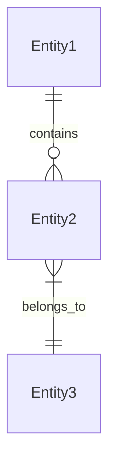
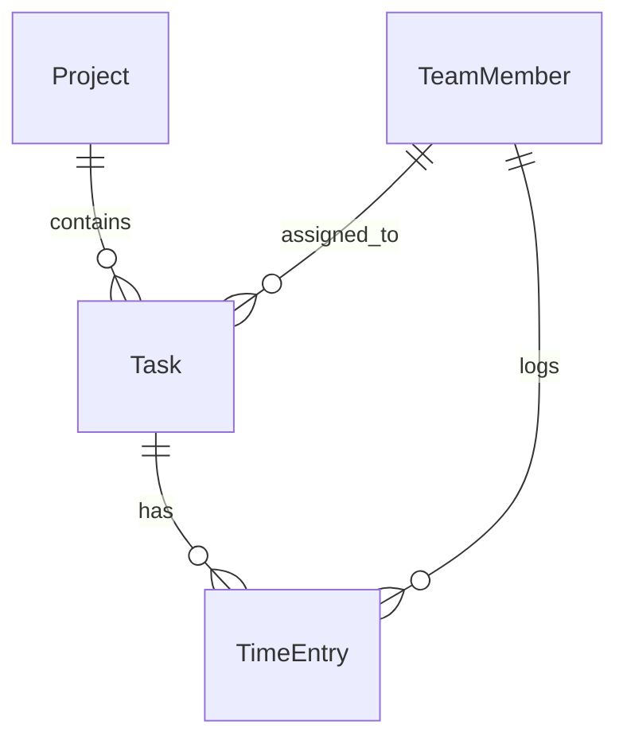
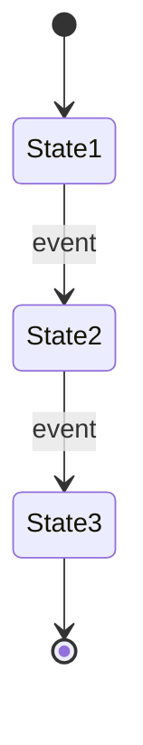
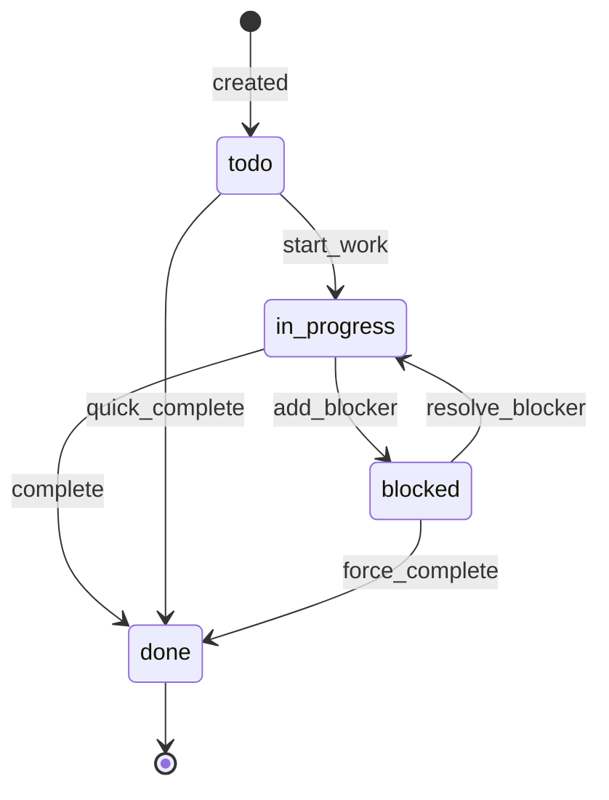

# 🏆 Golden Plan Complete Guide v4.0

> **For Cursor Agents:** This document contains everything needed to build a 100% functional system from scratch. Read completely before executing.

## 🚨 MANDATORY: Agent Build Protocol

**Before building ANY system, read `docs/AGENT_BUILD_PROTOCOL.md`**

This protocol prevents common agent mistakes:
- ❌ Writing pages from scratch instead of enhancing scaffolds
- ❌ Regenerating existing implementations
- ❌ Skipping verification checkpoints
- ❌ Bypassing the Factory pipeline

The protocol specifies the EXACT build sequence and which files to use vs generate.

---

## 📋 Table of Contents

1. [Overview](#1-overview)
2. [Pre-Flight Checklist](#2-pre-flight-checklist)
3. [Section A: Domain Definition](#3-section-a-domain-definition)
4. [Section B: Data Model](#4-section-b-data-model)
5. [Section C: User Journeys](#5-section-c-user-journeys)
6. [Section D: UI Surfaces (Mockups)](#6-section-d-ui-surfaces-mockups)
7. [Section E: AI Jobs & Prompts](#7-section-e-ai-jobs--prompts)
8. [Section F: Business Logic Specifications](#8-section-f-business-logic-specifications-new)
9. [Section G: Environment & Secrets](#9-section-g-environment--secrets)
10. [Build Sequence](#10-build-sequence)
11. [Verification Checklist](#11-verification-checklist)
12. [Template Files](#12-template-files)

---

## 1. Overview

### What is a Golden Plan?

A Golden Plan is a **complete specification** that enables the Ignite Zero Factory to generate a fully functional application with:

- ✅ All UI pages working
- ✅ All data operations functional
- ✅ All AI features operational
- ✅ All business logic implemented
- ✅ Zero manual tweaking required

### Architecture Summary

```
┌─────────────────────────────────────────────────────────────────┐
│                         Golden Plan                              │
│  ┌──────────┐  ┌──────────┐  ┌──────────┐  ┌──────────────────┐ │
│  │ Manifest │  │ Mockups  │  │ AI Jobs  │  │ Logic Specs      │ │
│  │ (Data)   │  │ (UI)     │  │ (Brain)  │  │ (Behavior)  NEW! │ │
│  └────┬─────┘  └────┬─────┘  └────┬─────┘  └────────┬─────────┘ │
└───────┼─────────────┼─────────────┼─────────────────┼───────────┘
        ▼             ▼             ▼                 ▼
   contracts.ts   pages/*.tsx   strategies/*.ts   stores/*.ts
        │             │             │                 │
        └─────────────┴─────────────┴─────────────────┘
                              │
                              ▼
                    🎉 Working Application
```

---

## 2. Pre-Flight Checklist

Before writing your Golden Plan, confirm:

- [ ] You understand the domain you're building
- [ ] You've identified all user personas
- [ ] You know what data entities are needed
- [ ] You've sketched the main user flows
- [ ] You've identified any complex algorithms/logic

---

## 3. Section A: Domain Definition

### Template

```markdown
## A. Domain Definition

### A.1 Product Name
[Your product name]

### A.2 Tagline
[One-line description]

### A.3 Problem Statement
[What problem does this solve? 2-3 sentences]

### A.4 Target Users
| Persona | Description | Primary Goal |
|---------|-------------|--------------|
| [Name]  | [Who they are] | [What they want to achieve] |

### A.5 Key Features
1. [Feature 1]
2. [Feature 2]
3. [Feature 3]
```

### Example

```markdown
## A. Domain Definition

### A.1 Product Name
TaskFlow Pro

### A.2 Tagline
AI-powered project management for distributed teams

### A.3 Problem Statement
Remote teams struggle to coordinate tasks across time zones. 
TaskFlow Pro uses AI to auto-schedule tasks, predict blockers, 
and optimize team workload distribution.

### A.4 Target Users
| Persona | Description | Primary Goal |
|---------|-------------|--------------|
| Project Manager | Oversees multiple projects | Keep projects on track |
| Team Member | Individual contributor | Know what to work on next |
| Executive | Leadership oversight | See portfolio health |

### A.5 Key Features
1. AI task scheduling with timezone awareness
2. Predictive blocker detection
3. Automated status reports
4. Workload balancing recommendations
```

---

## 4. Section B: Data Model

### Template

```markdown
## B. Data Model

### B.1 Root Entities

| Entity | Slug | Description |
|--------|------|-------------|
| [Name] | [slug] | [What it represents] |

#### [Entity Name] Fields
| Field | Type | Required | Description |
|-------|------|----------|-------------|
| [name] | [string/number/enum/json/date/boolean] | [Yes/No] | [Purpose] |

### B.2 Child Entities
[Same format as root entities]

### B.3 Relationships

```

### Example

```markdown
## B. Data Model

### B.1 Root Entities

| Entity | Slug | Description |
|--------|------|-------------|
| Project | project | A collection of tasks with timeline |
| Task | task | A single unit of work |
| TeamMember | team-member | A person on the team |

#### Project Fields
| Field | Type | Required | Description |
|-------|------|----------|-------------|
| title | string | Yes | Project name |
| status | enum: draft/active/completed/archived | Yes | Current state |
| start_date | date | No | Planned start |
| end_date | date | No | Planned completion |
| owner_id | string | Yes | TeamMember who owns this |
| ai_health_score | number | No | 0-100 AI-computed health |
| settings | json | No | Project configuration |

#### Task Fields
| Field | Type | Required | Description |
|-------|------|----------|-------------|
| title | string | Yes | Task name |
| status | enum: todo/in_progress/blocked/done | Yes | Current state |
| priority | enum: low/medium/high/critical | Yes | Importance |
| assignee_id | string | No | TeamMember assigned |
| project_id | string | Yes | Parent project |
| due_date | date | No | Deadline |
| estimated_hours | number | No | Time estimate |
| ai_suggested_date | date | No | AI-recommended schedule |
| blockers | json | No | List of blocking issues |

### B.2 Child Entities

#### TimeEntry Fields
| Field | Type | Required | Description |
|-------|------|----------|-------------|
| task_id | string | Yes | Parent task |
| member_id | string | Yes | Who logged time |
| hours | number | Yes | Hours worked |
| date | date | Yes | When work was done |
| notes | string | No | Optional description |

### B.3 Relationships

```

---

## 5. Section C: User Journeys

### Template

```markdown
## C. User Journeys

### C.1 [Persona] Journey: [Goal]

**Trigger:** [What initiates this journey]

**Steps:**
1. [Action] → [Page/Screen] → [Expected Result]
2. [Action] → [Page/Screen] → [Expected Result]
3. ...

**Success Criteria:**
- [ ] [Measurable outcome]

**Edge Cases:**
- If [condition], then [behavior]
```

### Example

```markdown
## C. User Journeys

### C.1 Project Manager Journey: Create and Schedule Project

**Trigger:** PM has a new initiative to track

**Steps:**
1. Click "New Project" → Project Creator Modal → Form appears
2. Fill title, dates, team members → Form → Validation passes
3. Click "Create with AI Schedule" → Loading state → AI analyzes and suggests task breakdown
4. Review AI suggestions → Task List → Can accept/modify/reject each
5. Click "Finalize" → Project Dashboard → Project is active with scheduled tasks

**Success Criteria:**
- [ ] Project created with at least 3 tasks
- [ ] All tasks have AI-suggested dates
- [ ] Owner receives confirmation notification

**Edge Cases:**
- If no team members selected, show warning but allow creation
- If date range is < 1 week, AI suggests condensed schedule
- If AI fails, allow manual task creation as fallback

### C.2 Team Member Journey: Complete Daily Tasks

**Trigger:** Team member starts their work day

**Steps:**
1. Open app → Dashboard → See "Today's Tasks" widget
2. Click task → Task Detail → See description, context, blockers
3. Start timer → Task Detail → Timer running, status → in_progress
4. Mark complete → Task Detail → Status → done, time logged
5. View next task → Dashboard → Auto-advances to next priority item

**Success Criteria:**
- [ ] At least 1 task completed
- [ ] Time automatically logged
- [ ] Next task visible

**Edge Cases:**
- If task is blocked, show blocker resolution wizard
- If no tasks today, show "All caught up!" state
- If overdue tasks exist, show them first with warning
```

---

## 6. Section D: UI Surfaces (Mockups)

### Template

```markdown
## D. UI Surfaces

### D.1 Route Map

| Route | Page Name | Persona | States |
|-------|-----------|---------|--------|
| [path] | [Name] | [Who uses it] | [default, loading, empty, error] |

### D.2 Page Specifications

#### [Page Name]
- **Route:** `/path`
- **Mockup File:** `mockups/page-name.html`
- **States:** default, loading, empty, error

**Layout:**
```
┌─────────────────────────────────────┐
│ Header: [description]                │
├─────────────────────────────────────┤
│ Section 1: [description]             │
│ ┌─────────────┐ ┌─────────────┐     │
│ │ Component A │ │ Component B │     │
│ └─────────────┘ └─────────────┘     │
├─────────────────────────────────────┤
│ Section 2: [description]             │
└─────────────────────────────────────┘
```

**CTAs (Call-to-Actions):**
| CTA ID | Label | Action | Target |
|--------|-------|--------|--------|
| [id] | [Button text] | [navigate/save/enqueueJob] | [path/entity/jobType] |

**Data Bindings:**
| Element | Source | Entity.Field |
|---------|--------|--------------|
| [element] | [context/fetch] | [Entity.field] |
```

### Example

```markdown
## D. UI Surfaces

### D.1 Route Map

| Route | Page Name | Persona | States |
|-------|-----------|---------|--------|
| `/dashboard` | Dashboard | All | default, loading |
| `/projects` | Project List | PM | default, empty |
| `/projects/:id` | Project Detail | PM, TM | default, loading, not-found |
| `/tasks/today` | Today's Tasks | TM | default, empty |
| `/admin/health` | System Health | Admin | default |

### D.2 Page Specifications

#### Dashboard
- **Route:** `/dashboard`
- **Mockup File:** `mockups/dashboard.html`
- **States:** default, loading

**Layout:**
```
┌─────────────────────────────────────┐
│ Header: Welcome back, {user.name}    │
├─────────────────────────────────────┤
│ KPI Row: [Active Projects] [Tasks Due] [Hours This Week] │
├───────────────────┬─────────────────┤
│ Today's Tasks     │ Project Health   │
│ ┌───────────────┐ │ ┌─────────────┐ │
│ │ Task Card x3  │ │ │ Health Chart│ │
│ └───────────────┘ │ └─────────────┘ │
├───────────────────┴─────────────────┤
│ Recent Activity Timeline             │
└─────────────────────────────────────┘
```

**CTAs:**
| CTA ID | Label | Action | Target |
|--------|-------|--------|--------|
| new-project | + New Project | navigate | /projects/new |
| view-task-{id} | View | navigate | /tasks/{id} |
| quick-complete-{id} | ✓ | save | Task.status=done |
| run-health-check | Refresh Health | enqueueJob | analyze_portfolio |

**Data Bindings:**
| Element | Source | Entity.Field |
|---------|--------|--------------|
| Active Projects count | context | projects.filter(active).length |
| Tasks Due count | context | tasks.filter(due_today).length |
| Task cards | context | tasks.filter(assignee=me, due_today) |
| Health chart | fetch | Project.ai_health_score |
```

---

## 7. Section E: AI Jobs & Prompts

### Template

```markdown
## E. AI Jobs & Prompts

### E.1 Job Registry

| Job ID | Target Entity | Mode | Trigger |
|--------|---------------|------|---------|
| [id] | [Entity] | sync/async | [CTA or event] |

### E.2 Job Specifications

#### [Job ID]
- **Target Entity:** [Entity]
- **Execution Mode:** synchronous | async
- **UI Placement:** [Where the trigger appears]
- **Icon:** [Lucide icon name]

**Input Schema:**
```typescript
{
  entity_id: string;        // Target entity ID
  [field]: [type];          // Additional inputs
}
```

**Prompt Template:**
```
You are a [role]. Given the following context:
- {{field1}}
- {{field2}}

[Instructions]

Return JSON:
{
  "summary": string,
  "[output_field]": [type]
}
```

**Output Schema:**
```typescript
{
  summary: string;
  [field]: [type];
}
```

**Error Handling:**
- If [condition]: return `{ "error": "[message]" }`
```

### Example

```markdown
## E. AI Jobs & Prompts

### E.1 Job Registry

| Job ID | Target Entity | Mode | Trigger |
|--------|---------------|------|---------|
| schedule_tasks | Project | async | Create project CTA |
| detect_blockers | Task | sync | Task detail load |
| generate_report | Project | async | Export button |
| suggest_assignee | Task | sync | Assignee dropdown |

### E.2 Job Specifications

#### schedule_tasks
- **Target Entity:** Project
- **Execution Mode:** async
- **UI Placement:** Project creation wizard
- **Icon:** CalendarClock

**Input Schema:**
```typescript
{
  project_id: string;
  team_member_ids: string[];
  start_date: string;
  end_date: string;
  description: string;
}
```

**Prompt Template:**
```
You are a project scheduling AI. Given:
- Project: {{description}}
- Timeline: {{start_date}} to {{end_date}}
- Team size: {{team_member_ids.length}} members

Break this project into tasks. Consider:
1. Logical task dependencies
2. Team workload balance
3. Buffer time for reviews

Return JSON:
{
  "summary": "Brief scheduling rationale",
  "tasks": [
    {
      "title": "Task name",
      "estimated_hours": number,
      "suggested_assignee_index": number,
      "suggested_start": "YYYY-MM-DD",
      "suggested_end": "YYYY-MM-DD",
      "dependencies": ["task_title"]
    }
  ]
}
```

**Output Schema:**
```typescript
{
  summary: string;
  tasks: Array<{
    title: string;
    estimated_hours: number;
    suggested_assignee_index: number;
    suggested_start: string;
    suggested_end: string;
    dependencies: string[];
  }>;
}
```

**Error Handling:**
- If date range < 3 days: return `{ "error": "Project timeline too short for AI scheduling" }`
- If no team members: return `{ "error": "At least one team member required" }`

#### detect_blockers
- **Target Entity:** Task
- **Execution Mode:** synchronous
- **UI Placement:** Task detail sidebar
- **Icon:** AlertTriangle

**Input Schema:**
```typescript
{
  task_id: string;
  task_title: string;
  task_status: string;
  related_tasks: Array<{ id: string; title: string; status: string }>;
  recent_activity: string[];
}
```

**Prompt Template:**
```
You are a project risk analyst. Analyze this task for potential blockers:
- Task: {{task_title}} ({{task_status}})
- Related tasks: {{related_tasks}}
- Recent activity: {{recent_activity}}

Identify:
1. Dependency blockers (tasks that must complete first)
2. Resource blockers (missing assignee, unclear requirements)
3. Timeline risks (approaching deadline with incomplete dependencies)

Return JSON:
{
  "summary": "One-line risk assessment",
  "risk_level": "low" | "medium" | "high",
  "blockers": [
    {
      "type": "dependency" | "resource" | "timeline",
      "description": "What's blocking",
      "suggestion": "How to resolve"
    }
  ]
}
```
```

---

## 8. Section F: Business Logic Specifications (NEW!)

> **CRITICAL:** This section ensures 100% functionality. Do not skip.

### Template

```markdown
## F. Business Logic Specifications

### F.1 State Machines

#### [Feature] State Machine


**States:**
| State | Description | Entry Condition |
|-------|-------------|-----------------|
| [name] | [what it means] | [how we get here] |

**Transitions:**
| From | To | Event | Side Effects |
|------|-----|-------|--------------|
| [state] | [state] | [trigger] | [what happens] |

### F.2 Algorithms

#### [Algorithm Name]
**Purpose:** [What it does]

**Pseudocode:**
```
INPUT: [parameters]
OUTPUT: [result]

1. [Step]
2. [Step]
   IF [condition]:
     [action]
   ELSE:
     [action]
3. RETURN [result]
```

**Edge Cases:**
- [Case]: [Handling]

### F.3 Computed Properties

| Property | Formula | Used In |
|----------|---------|---------|
| [name] | [calculation] | [where it's displayed] |

### F.4 Client-Side Stores

#### [Store Name]
**Purpose:** [What state it manages]

**Schema:**
```typescript
interface [StoreName]State {
  // Data
  [field]: [type];
  
  // UI State
  [field]: [type];
  
  // Actions
  [action]: (params) => void;
}
```

**Initial State:**
```typescript
{
  [field]: [defaultValue],
}
```

**Actions:**
| Action | Parameters | Effect |
|--------|------------|--------|
| [name] | [params] | [what it does] |

### F.5 Validation Rules

| Entity | Field | Rule | Error Message |
|--------|-------|------|---------------|
| [entity] | [field] | [validation] | [message] |

### F.6 Business Rules

| Rule ID | Description | Enforcement |
|---------|-------------|-------------|
| [BR-001] | [Rule description] | [Where/how enforced] |
```

### Example

```markdown
## F. Business Logic Specifications

### F.1 State Machines

#### Task Lifecycle State Machine


**States:**
| State | Description | Entry Condition |
|-------|-------------|-----------------|
| todo | Task created, not started | Initial creation |
| in_progress | Actively being worked | User clicks "Start" |
| blocked | Cannot proceed | Blocker added |
| done | Work completed | User clicks "Complete" |

**Transitions:**
| From | To | Event | Side Effects |
|------|-----|-------|--------------|
| todo | in_progress | start_work | Set started_at timestamp, start timer |
| in_progress | done | complete | Log time entry, update project progress |
| in_progress | blocked | add_blocker | Notify project manager, pause timer |
| blocked | in_progress | resolve_blocker | Resume timer, log resolution |

### F.2 Algorithms

#### Task Priority Scoring
**Purpose:** Calculate dynamic priority for task ordering

**Pseudocode:**
```
INPUT: task, current_date
OUTPUT: priority_score (0-100)

1. base_score = PRIORITY_WEIGHTS[task.priority]  // low=20, medium=40, high=60, critical=80
2. 
3. // Deadline urgency (0-20 points)
4. IF task.due_date exists:
   days_until_due = task.due_date - current_date
   IF days_until_due < 0:
     urgency_score = 20  // Overdue
   ELSE IF days_until_due < 1:
     urgency_score = 15  // Due today
   ELSE IF days_until_due < 3:
     urgency_score = 10  // Due soon
   ELSE:
     urgency_score = 0
5.
6. // Blocker penalty (-10 points)
7. IF task.status == 'blocked':
   blocker_penalty = -10
8.
9. RETURN base_score + urgency_score + blocker_penalty
```

**Edge Cases:**
- No due date: urgency_score = 0
- Completed tasks: Don't calculate (filter out)
- Blocked + Overdue: Still shows but with warning

#### Workload Balancing
**Purpose:** Suggest optimal task assignee based on current workload

**Pseudocode:**
```
INPUT: task, team_members[], all_tasks[]
OUTPUT: suggested_assignee_id

1. FOR EACH member IN team_members:
   current_hours = SUM(
     all_tasks
       .filter(t => t.assignee_id == member.id && t.status != 'done')
       .map(t => t.estimated_hours)
   )
   member.workload_score = current_hours / member.weekly_capacity

2. // Find member with lowest workload who has required skills
3. candidates = team_members
     .filter(m => m.skills.includes(task.required_skill))
     .sort(m => m.workload_score)

4. IF candidates.length == 0:
   RETURN null  // No qualified members
   
5. RETURN candidates[0].id
```

### F.3 Computed Properties

| Property | Formula | Used In |
|----------|---------|---------|
| project.progress | tasks.filter(done).length / tasks.length * 100 | Project card, detail |
| project.days_remaining | project.end_date - today | Project header |
| member.utilization | assigned_hours / weekly_capacity * 100 | Team dashboard |
| task.is_overdue | task.due_date < today && task.status != 'done' | Task badge |
| project.at_risk | progress < expected_progress_for_date | Health indicator |

### F.4 Client-Side Stores

#### useTaskStore
**Purpose:** Manages task list state, filtering, and optimistic updates

**Schema:**
```typescript
interface TaskStoreState {
  // Data
  tasks: Task[];
  selectedTaskId: string | null;
  
  // Filters
  statusFilter: TaskStatus | 'all';
  assigneeFilter: string | 'all';
  
  // UI State
  isLoading: boolean;
  optimisticUpdates: Map<string, Partial<Task>>;
  
  // Actions
  setTasks: (tasks: Task[]) => void;
  selectTask: (id: string | null) => void;
  updateTaskOptimistic: (id: string, updates: Partial<Task>) => void;
  commitUpdate: (id: string) => void;
  rollbackUpdate: (id: string) => void;
  setFilter: (type: 'status' | 'assignee', value: string) => void;
}
```

**Initial State:**
```typescript
{
  tasks: [],
  selectedTaskId: null,
  statusFilter: 'all',
  assigneeFilter: 'all',
  isLoading: true,
  optimisticUpdates: new Map(),
}
```

**Actions:**
| Action | Parameters | Effect |
|--------|------------|--------|
| updateTaskOptimistic | id, updates | Immediately update UI, store original for rollback |
| commitUpdate | id | Remove from optimistic map (server confirmed) |
| rollbackUpdate | id | Restore original state (server rejected) |
| setFilter | type, value | Update filter, recompute visible tasks |

#### useTimerStore
**Purpose:** Manages active time tracking

**Schema:**
```typescript
interface TimerStoreState {
  activeTaskId: string | null;
  startTime: Date | null;
  elapsedSeconds: number;
  isPaused: boolean;
  
  startTimer: (taskId: string) => void;
  pauseTimer: () => void;
  resumeTimer: () => void;
  stopTimer: () => TimeEntry;
  tick: () => void;
}
```

### F.5 Validation Rules

| Entity | Field | Rule | Error Message |
|--------|-------|------|---------------|
| Project | title | min 3 chars, max 100 | "Project name must be 3-100 characters" |
| Project | end_date | >= start_date | "End date must be after start date" |
| Task | title | min 1 char, max 200 | "Task name is required" |
| Task | estimated_hours | 0.25 - 1000 | "Estimate must be between 15 minutes and 1000 hours" |
| TimeEntry | hours | 0.25 - 24 | "Time entry must be between 15 minutes and 24 hours" |

### F.6 Business Rules

| Rule ID | Description | Enforcement |
|---------|-------------|-------------|
| BR-001 | Tasks cannot be assigned to members not in the project | Assignee dropdown filters by project members |
| BR-002 | Completed projects cannot have new tasks added | "Add Task" button disabled on completed projects |
| BR-003 | Time entries can only be edited within 7 days | Edit button hidden/disabled after 7 days |
| BR-004 | Critical tasks must have a due date | Validation on save |
| BR-005 | Projects must have at least one task before activation | "Activate" button disabled if tasks.length == 0 |
```

---

## 9. Section G: Environment & Secrets

### Template

```markdown
## G. Environment & Secrets

### G.1 Frontend Environment Variables

| Variable | Required | Default | Description |
|----------|----------|---------|-------------|
| VITE_SUPABASE_URL | Yes | - | Supabase project URL |
| VITE_SUPABASE_ANON_KEY | Yes | - | Public anon key |
| [VITE_...] | [Yes/No] | [default] | [description] |

### G.2 Backend Environment Variables

| Variable | Required | Default | Description |
|----------|----------|---------|-------------|
| SUPABASE_URL | Yes | - | Supabase project URL |
| SUPABASE_SERVICE_ROLE_KEY | Yes | - | Service role key (secret!) |
| OPENAI_API_KEY | Yes | - | For AI jobs |
| [VAR] | [Yes/No] | [default] | [description] |

### G.3 MCP Server Variables

| Variable | Required | Default | Description |
|----------|----------|---------|-------------|
| PORT | No | 4000 | Server port |
| MCP_AUTH_TOKEN | Yes | - | Auth token for requests |
| [VAR] | [Yes/No] | [default] | [description] |
```

---

## 10. Build Sequence

### For the Cursor Agent

Execute these steps in order:

```bash
# 1. Validate the Golden Plan (checks all sections A-G)
npx tsx scripts/factory-guard.ts <workspace-path>

# 2. Generate contracts from manifest
npx tsx scripts/scaffold-manifest.ts

# 3. Generate business logic from Section F (if present)
npx tsx scripts/generate-logic.ts <workspace-path>

# 4. Compile mockups to React
npx tsx scripts/compile-mockups.ts <workspace-path>

# 5. Type check
npm run typecheck

# 6. Run tests
npm run test

# 7. Verify system integrity
npm run verify
```

### What Each Step Produces

| Step | Input | Output |
|------|-------|--------|
| factory-guard.ts | PLAN.md, mockups/, system-manifest.json | Validation report (pass/fail) |
| scaffold-manifest.ts | system-manifest.json | src/lib/contracts.ts, strategies/*.ts |
| generate-logic.ts | PLAN.md Section F | src/store/generated/*.ts, src/lib/algorithms/*.ts |
| compile-mockups.ts | mockups/*.html | src/pages/generated/*.tsx |
| typecheck | All .ts/.tsx | Type errors (should be 0) |
| test | *.test.ts | Test report |
| verify | All | Final validation |

### Quick Start: Initialize a New Plan

```bash
# Create a new Golden Plan workspace from templates
npx tsx scripts/plan-init.ts ./my-new-project --name "My Product"

# This creates:
# - PLAN.md (template)
# - system-manifest.json (template)
# - mockups/ directory with layout.html, dashboard.html, item-editor.html
# - user_journey.md (template)
```

---

## 11. Verification Checklist

Before declaring "Golden Plan Complete":

### A. Data Layer
- [ ] All entities from Section B exist in system-manifest.json
- [ ] contracts.ts generated with correct Zod schemas
- [ ] Entity slugs match between manifest and code

### B. UI Layer
- [ ] All routes from Section D have mockup files
- [ ] All mockups have `data-route` attribute
- [ ] All CTAs have `data-cta-id` attributes
- [ ] All pages compile without errors
- [ ] All states (loading, empty, error) have mockups

### C. AI Layer
- [ ] All jobs from Section E exist in manifest `agent_jobs`
- [ ] All jobs have `prompt_template`
- [ ] All jobs have generated strategy files
- [ ] Job input/output schemas match prompt templates

### D. Logic Layer (NEW)
- [ ] All state machines from F.1 have corresponding stores
- [ ] All algorithms from F.2 have implementation files
- [ ] All computed properties from F.3 are implemented
- [ ] All stores from F.4 are generated
- [ ] All validation rules from F.5 are enforced
- [ ] All business rules from F.6 are implemented

### E. Integration
- [ ] `npm run typecheck` passes
- [ ] `npm run test` passes
- [ ] `npm run verify` passes
- [ ] Application starts without errors
- [ ] All user journeys from Section C work end-to-end

---

## 12. Template Files

### system-manifest.json Template

```json
{
  "branding": {
    "name": "[Product Name]",
    "tagline": "[Tagline]"
  },
  "data_model": {
    "root_entities": [
      {
        "name": "[EntityName]",
        "slug": "[entity-slug]",
        "fields": [
          { "name": "[field]", "type": "[string|number|boolean|date|json]" },
          { "name": "[field]", "type": "enum", "options": ["a", "b", "c"] }
        ]
      }
    ],
    "child_entities": [
      {
        "name": "[ChildEntity]",
        "slug": "[child-slug]",
        "fields": [
          { "name": "parent_id", "type": "string" }
        ]
      }
    ]
  },
  "agent_jobs": [
    {
      "id": "[job_id]",
      "target_entity": "[Entity]",
      "execution_mode": "async",
      "ui": {
        "label": "[Button Label]",
        "icon": "[LucideIconName]",
        "placement": "[where_in_ui]"
      },
      "prompt_template": "[Full prompt with {{placeholders}}. Return JSON {...}]"
    }
  ]
}
```

### Mockup HTML Template

```html
<!DOCTYPE html>
<html lang="en">
<head>
  <meta charset="UTF-8">
  <title>[Page Name]</title>
  <link rel="stylesheet" href="_design-system.css">
</head>
<body data-route="/[path]" data-entity="[Entity]">
  <header>
    <h1>[Page Title]</h1>
    <button data-cta-id="[action-id]" data-action="navigate" data-target="/[path]">
      [Button Text]
    </button>
  </header>
  
  <main>
    <section>
      <div data-field="[field_name]">{placeholder}</div>
      
      <form data-form="[form-id]">
        <input data-field="title" placeholder="Enter title">
        <button data-cta-id="save-[entity]" data-action="save" data-entity="[Entity]">
          Save
        </button>
      </form>
      
      <button data-cta-id="run-ai-[job]" data-action="enqueueJob" data-job-type="[job_id]">
        Run AI Analysis
      </button>
    </section>
  </main>
</body>
</html>
```

### PLAN.md Template

```markdown
# [Product Name] – Golden Plan

## A. Domain Definition
[Fill from Section 3]

## B. Data Model
[Fill from Section 4]

## C. User Journeys
[Fill from Section 5]

## D. UI Surfaces
[Fill from Section 6]

## E. AI Jobs & Prompts
[Fill from Section 7]

## F. Business Logic Specifications
[Fill from Section 8]

## G. Environment & Secrets
[Fill from Section 9]

---

## Verification
- [ ] Manifest valid
- [ ] All mockups present
- [ ] All CTAs mapped
- [ ] All logic specified
- [ ] Build sequence passes
```

---

## Quick Reference Card

```
┌────────────────────────────────────────────────────────────────┐
│                    GOLDEN PLAN QUICK REFERENCE                  │
├────────────────────────────────────────────────────────────────┤
│                                                                 │
│  REQUIRED SECTIONS:                                             │
│  ☐ A. Domain Definition (who, what, why)                       │
│  ☐ B. Data Model (entities, fields, relationships)             │
│  ☐ C. User Journeys (step-by-step flows)                       │
│  ☐ D. UI Surfaces (routes, mockups, CTAs)                      │
│  ☐ E. AI Jobs (prompts, inputs, outputs)                       │
│  ☐ F. Business Logic (state machines, algorithms, stores)  NEW │
│  ☐ G. Environment (all required variables)                     │
│                                                                 │
│  BUILD COMMANDS:                                                │
│  1. npm run factory:guard -- <workspace>                       │
│  2. npx tsx scripts/scaffold-manifest.ts                       │
│  3. npx tsx scripts/generate-logic.ts <workspace>              │
│  4. npx tsx scripts/compile-mockups.ts <workspace>             │
│  5. npm run verify                                             │
│                                                                 │
│  SUCCESS = All checkboxes + verify passes + app works          │
│                                                                 │
└────────────────────────────────────────────────────────────────┘
```

---

## 13. Supabase Project Setup

> **CRITICAL FOR AGENTS:** This section MUST be completed before any deployment.

### 13.1 When to Ask for Credentials

**STOP and ask the user for credentials at these points:**

| Checkpoint | Required Credentials | Why |
|------------|---------------------|-----|
| Before first `npm run dev` | Supabase URL, Anon Key | Frontend needs backend connection |
| Before `supabase db push` | Supabase Access Token | CLI authentication |
| Before `supabase functions deploy` | Supabase Access Token | Deployment auth |
| Before AI jobs work | OpenAI/Anthropic API Key | AI inference |
| Before setting secrets | Service Role Key | Admin operations |

### 13.2 Supabase Dashboard Setup

**Step 1: Create Project**
```
1. Go to https://supabase.com/dashboard
2. Click "New Project"
3. Fill in:
   - Name: [product-name]
   - Database Password: [generate strong password - SAVE THIS]
   - Region: [closest to users]
4. Wait for provisioning (~2 minutes)
```

**Step 2: Get API Keys**
```
1. Go to Project Settings → API
2. Copy these values:
   - Project URL: https://[ref].supabase.co
   - anon public key: eyJ...
   - service_role key: eyJ... (SECRET - never expose in frontend!)
```

**Step 3: Get Access Token for CLI**
```
1. Go to https://supabase.com/dashboard/account/tokens
2. Click "Generate new token"
3. Name it: "[product-name]-deploy"
4. Copy the token: sbp_... (starts with sbp_)
5. SAVE THIS - you cannot see it again
```

### 13.3 Environment Files Structure

Create these files (all git-ignored):

**`.env.local` (Frontend - Vite)**
```env
# Supabase Connection
VITE_SUPABASE_URL=https://[your-ref].supabase.co
VITE_SUPABASE_PUBLISHABLE_KEY=eyJ...your-anon-key...

# Mode Switches
VITE_USE_MOCK=false
VITE_ENABLE_DEV=true

# MCP Proxy (for local development)
VITE_USE_MCP_PROXY=true
VITE_MCP_URL=http://127.0.0.1:4000
VITE_MCP_AUTH_TOKEN=dev-local-secret
```

**`lms-mcp/.env` (MCP Server)**
```env
PORT=4000
HOST=127.0.0.1
MCP_AUTH_TOKEN=dev-local-secret

SUPABASE_URL=https://[your-ref].supabase.co
SUPABASE_ANON_KEY=eyJ...your-anon-key...
AGENT_TOKEN=[your-agent-token]
ORGANIZATION_ID=[your-org-uuid]
```

**`supabase/.deploy.env` (Edge Function Secrets)**
```env
AGENT_TOKEN=[your-agent-token]
ANTHROPIC_API_KEY=sk-ant-...
OPENAI_API_KEY=sk-...
```

---

## 14. Database Setup & Migrations

### 14.1 Initial Schema

**Step 1: Link Project**
```bash
# Login to Supabase CLI
npx supabase login

# Link to your project
npx supabase link --project-ref [your-project-ref]
```

**Step 2: Apply Migrations**
```bash
# Push all migrations
npx supabase db push
```

### 14.2 Required Tables

The Factory expects these tables (auto-created by migrations):

```sql
-- Organizations (multi-tenant)
CREATE TABLE organizations (
  id UUID PRIMARY KEY DEFAULT gen_random_uuid(),
  name TEXT NOT NULL,
  slug TEXT UNIQUE NOT NULL,
  branding JSONB DEFAULT '{}',
  settings JSONB DEFAULT '{}',
  created_at TIMESTAMPTZ DEFAULT now()
);

-- Generic Records (entity storage)
CREATE TABLE records (
  id UUID PRIMARY KEY DEFAULT gen_random_uuid(),
  organization_id UUID REFERENCES organizations(id),
  entity_type TEXT NOT NULL,  -- matches manifest slug
  content JSONB NOT NULL,
  created_at TIMESTAMPTZ DEFAULT now(),
  updated_at TIMESTAMPTZ DEFAULT now()
);

-- Job Queue
CREATE TABLE job_tickets (
  id UUID PRIMARY KEY DEFAULT gen_random_uuid(),
  organization_id UUID REFERENCES organizations(id),
  job_type TEXT NOT NULL,
  status TEXT DEFAULT 'queued',  -- queued, running, completed, failed
  payload JSONB DEFAULT '{}',
  result JSONB,
  error TEXT,
  created_at TIMESTAMPTZ DEFAULT now(),
  completed_at TIMESTAMPTZ
);

-- RLS Policies
ALTER TABLE records ENABLE ROW LEVEL SECURITY;
ALTER TABLE job_tickets ENABLE ROW LEVEL SECURITY;

-- Policy: Users see their org's data only
CREATE POLICY "Org isolation" ON records
  FOR ALL USING (
    organization_id IN (
      SELECT organization_id FROM user_roles 
      WHERE user_id = auth.uid()
    )
  );
```

### 14.3 Storage Buckets

```bash
# Create bucket for JSON content
npx supabase storage create content --public

# Create bucket for media uploads  
npx supabase storage create media --public
```

---

## 15. Edge Function Deployment

> **⚠️ CRITICAL: Read this ENTIRE section before deploying. AI agents fail 80% of deployments by skipping these rules.**

### 15.1 The SUPABASE_ACCESS_TOKEN Problem

**The #1 cause of deployment failures:**

```powershell
# ❌ WRONG - Token not set, will get 401
npx supabase functions deploy my-function

# ✅ CORRECT - Set token FIRST
$env:SUPABASE_ACCESS_TOKEN = "sbp_your_token_here"
npx supabase functions deploy my-function --project-ref [your-ref]
```

**Token Recovery (if lost):**
```powershell
# Search terminal history for previously used tokens
findstr /s "sbp_" ".cursor/projects/*/terminals/*"
```

### 15.2 Import Rules (503 Prevention)

**CORRECT Imports (MUST use these exactly):**
```typescript
// ✅ Supabase client - MUST use npm: specifier
import { createClient } from "npm:@supabase/supabase-js@2";

// ✅ CORS helpers - MUST use these exact exports
import { stdHeaders, handleOptions } from "../_shared/cors.ts";

// ✅ Deno standard library
import { serve } from "https://deno.land/std@0.168.0/http/server.ts";
```

**WRONG Imports (Will cause 503 startup crash):**
```typescript
// ❌ WRONG: esm.sh is flaky
import { createClient } from "https://esm.sh/@supabase/supabase-js@2";

// ❌ WRONG: Bare import without npm: prefix
import { createClient } from "@supabase/supabase-js";

// ❌ WRONG: corsHeaders doesn't exist
import { corsHeaders } from "../_shared/cors.ts";
```

### 15.3 Supabase Client Pattern

```typescript
// ✅ CORRECT: Client at TOP LEVEL (outside serve())
const SUPABASE_URL = Deno.env.get("SUPABASE_URL");
const SUPABASE_SERVICE_ROLE_KEY = Deno.env.get("SUPABASE_SERVICE_ROLE_KEY");

if (!SUPABASE_URL || !SUPABASE_SERVICE_ROLE_KEY) {
  throw new Error("SUPABASE_URL and SUPABASE_SERVICE_ROLE_KEY are required");
}

// Create client ONCE at module load
const supabase = createClient(SUPABASE_URL, SUPABASE_SERVICE_ROLE_KEY);

serve(async (req: Request): Promise<Response> => {
  // Use the pre-created client
  const { data, error } = await supabase.from("table").select("*");
});
```

### 15.4 CORS Response Pattern

```typescript
import { stdHeaders, handleOptions } from "../_shared/cors.ts";

serve(async (req: Request): Promise<Response> => {
  // Handle preflight
  if (req.method === "OPTIONS") {
    return handleOptions(req, "function-name");
  }

  try {
    // Success response
    return new Response(
      JSON.stringify({ ok: true, data: result }),
      { status: 200, headers: stdHeaders(req, { "Content-Type": "application/json" }) }
    );
  } catch (err) {
    // Error response
    return new Response(
      JSON.stringify({ error: String(err) }),
      { status: 500, headers: stdHeaders(req, { "Content-Type": "application/json" }) }
    );
  }
});
```

### 15.5 Hybrid Authorization Pattern

```typescript
serve(async (req: Request): Promise<Response> => {
  if (req.method === "OPTIONS") return handleOptions(req, "my-function");

  // --- HYBRID AUTHORIZATION ---
  let isAuthorized = false;
  let userId = null;

  // 1. Agent Token Check (for background workers/AI jobs)
  const token = req.headers.get("x-agent-token");
  if (AGENT_TOKEN && token === AGENT_TOKEN) {
    isAuthorized = true;
    userId = "agent";
  } 
  // 2. User Session Check (for frontend calls)
  else if (req.headers.get("Authorization")) {
    const client = createClient(SUPABASE_URL!, SUPABASE_ANON_KEY!, {
      global: { headers: { Authorization: req.headers.get("Authorization")! } }
    });
    const { data: { user } } = await client.auth.getUser();
    if (user) {
      isAuthorized = true;
      userId = user.id;
    }
  }

  if (!isAuthorized) {
    return new Response(JSON.stringify({ error: "Unauthorized" }), { 
      status: 401, headers: stdHeaders(req, { "Content-Type": "application/json" }) 
    });
  }
  // --- END AUTHORIZATION ---

  // Your logic here...
});
```

### 15.6 Deployment Commands

**Deploy All Functions:**
```powershell
# PowerShell (Windows)
$env:SUPABASE_ACCESS_TOKEN = "sbp_your_token"
.\scripts\ci\deploy-functions.ps1 -EnvPath supabase/.deploy.env

# Bash (Mac/Linux)
export SUPABASE_ACCESS_TOKEN="sbp_your_token"
./scripts/ci/deploy-functions.sh
```

**Deploy Single Function:**
```powershell
$env:SUPABASE_ACCESS_TOKEN = "sbp_your_token"
npx supabase functions deploy save-record --project-ref [your-ref]
```

**Set Secrets:**
```powershell
# Note: SUPABASE_* prefixed vars are auto-injected, cannot be set manually
npx supabase secrets set AGENT_TOKEN="your-token" --project-ref [your-ref]
npx supabase secrets set ANTHROPIC_API_KEY="sk-ant-..." --project-ref [your-ref]
npx supabase secrets set OPENAI_API_KEY="sk-..." --project-ref [your-ref]
```

### 15.7 Verification After Deployment

**ALWAYS run after every deployment:**
```bash
npx tsx scripts/verify-live-deployment.ts
```

**Expected Results:**
| Function | Expected | Notes |
|----------|----------|-------|
| `list-jobs` | ✅ 200 | Should return job array |
| `save-record` | ✅ 200 | Should return `{ ok: true, id: "..." }` |
| `get-record` | 404 | Expected - fetches non-existent |
| `enqueue-job` | 401 | Expected without AGENT_TOKEN |

### 15.8 Debugging 503 Errors

**503 = Function crashed at startup. Checklist:**

1. [ ] All imports use `npm:` specifier?
2. [ ] CORS exports are `stdHeaders`, `handleOptions` (not `corsHeaders`)?
3. [ ] No `!` assertions on env vars (use `if (!var) throw`)?
4. [ ] Supabase client created at TOP LEVEL?
5. [ ] No syntax errors?

**Debug Steps:**
```bash
# Check logs
npx supabase functions logs save-record --project-ref [your-ref]

# Compare with known-working function
diff supabase/functions/my-function/index.ts supabase/functions/list-jobs/index.ts
```

---

## 16. MCP Server Deployment

### 16.1 What is the MCP Server?

The MCP (Microservice Control Plane) server is a local proxy that:
- Intercepts frontend calls during development
- Routes to local AI strategies (for testing without OpenAI costs)
- Forwards to Supabase Edge Functions (for production-like testing)

### 16.2 Setup

```bash
# Navigate to MCP directory
cd lms-mcp

# Install dependencies
npm install

# Copy environment file
cp env.example .env

# Edit .env with your values
```

**`lms-mcp/.env` contents:**
```env
PORT=4000
HOST=127.0.0.1
MCP_AUTH_TOKEN=dev-local-secret

SUPABASE_URL=https://[your-ref].supabase.co
SUPABASE_ANON_KEY=eyJ...
AGENT_TOKEN=[your-agent-token]
ORGANIZATION_ID=[your-org-uuid]

# Optional: Use local AI strategies instead of Edge Functions
USE_LOCAL_RUNNER=false
```

### 16.3 Running the Server

```bash
cd lms-mcp
npm start

# Or with specific environment
PORT=4000 HOST=127.0.0.1 MCP_AUTH_TOKEN=dev-local-secret npm start
```

**Expected output:**
```
🚀 MCP Server listening on http://127.0.0.1:4000
```

### 16.4 Testing MCP Connection

```bash
# Health check
curl http://127.0.0.1:4000/rpc \
  -H "Content-Type: application/json" \
  -H "Authorization: Bearer dev-local-secret" \
  -d '{"method": "lms.health", "params": {}}'

# Expected response:
# {"ok": true, "version": "1.0.0", "uptime": ...}
```

### 16.5 Frontend Connection

**In `.env.local`:**
```env
VITE_USE_MCP_PROXY=true
VITE_MCP_URL=http://127.0.0.1:4000
VITE_MCP_AUTH_TOKEN=dev-local-secret
```

---

## 17. Validation Scripts

### 17.1 Complete Verification Sequence

Run this sequence before calling any build "done":

```bash
# 1. Check MCP/system health (if MCP running)
npm run diag:lms

# 2. Type safety check
npm run typecheck

# 3. Unit tests
npm run test

# 4. Mock coverage validation
npm run mock:validate

# 5. CTA smoke tests
npm run test:cta-smoke

# 6. Full verification
npm run verify

# 7. Live Edge Function verification (after deployment)
VERIFY_LIVE=1 npm run verify
```

### 17.2 What Each Script Checks

| Script | What It Validates |
|--------|-------------------|
| `diag:lms` | MCP server health, job queue status |
| `typecheck` | All TypeScript compiles without errors |
| `test` | Unit tests pass |
| `mock:validate` | All mockups have required CTAs and data bindings |
| `test:cta-smoke` | All CTAs are wired and functional |
| `verify` | Contracts exist, types pass, tests pass |
| `verify:live` | Edge Functions respond correctly |

### 17.3 CI/CD Integration

```yaml
# .github/workflows/verify.yml
name: Verify System
on: [push, pull_request]

jobs:
  verify:
    runs-on: ubuntu-latest
    steps:
      - uses: actions/checkout@v3
      - uses: actions/setup-node@v3
        with:
          node-version: '18'
      
      - run: npm ci
      - run: npm run typecheck
      - run: npm run test
      - run: npm run mock:validate
      - run: npm run verify
```

---

## 18. AI API Keys

### 18.1 When to Request Keys

**ASK the user for AI keys when:**

| Situation | Required Key |
|-----------|--------------|
| AI job in manifest has `execution_mode: async` | OpenAI or Anthropic |
| Any `prompt_template` in manifest | OpenAI or Anthropic |
| Chat features | OpenAI or Anthropic |
| Image generation | OpenAI (DALL-E) or Stability |

### 18.2 Setting AI Keys

**Supabase Edge Functions (Production):**
```bash
npx supabase secrets set OPENAI_API_KEY="sk-..." --project-ref [your-ref]
npx supabase secrets set ANTHROPIC_API_KEY="sk-ant-..." --project-ref [your-ref]
```

**Local MCP Server (Development):**
```env
# In lms-mcp/.env
OPENAI_API_KEY=sk-...
ANTHROPIC_API_KEY=sk-ant-...
```

### 18.3 No Silent Mocks Policy

**CRITICAL:** If an AI key is missing:

```typescript
// ✅ CORRECT: Fail loudly
if (!OPENAI_API_KEY) {
  throw new Error("BLOCKED: OPENAI_API_KEY missing. Set via supabase secrets set.");
}

// ❌ WRONG: Silent mock (user thinks AI is working)
if (!OPENAI_API_KEY) {
  return { result: "Mock AI response" }; // DON'T DO THIS
}
```

---

## 19. Common Agent Mistakes & Solutions

### 19.1 Deployment Failures

| Symptom | Cause | Solution |
|---------|-------|----------|
| `401 Unauthorized` on deploy | Missing SUPABASE_ACCESS_TOKEN | `$env:SUPABASE_ACCESS_TOKEN = "sbp_..."` |
| `503 Service Unavailable` | Bad import or startup crash | Check imports use `npm:`, check CORS exports |
| `500 Internal Error` | Runtime error in handler | Check logs, add try/catch |
| CORS error in browser | Wrong CORS headers | Use `stdHeaders(req, {...})` |

### 19.2 Data Flow Issues

| Symptom | Cause | Solution |
|---------|-------|----------|
| Data not saving | Entity slug mismatch | Check manifest vs. code uses same slug |
| Empty list returned | Wrong organization_id | Verify ORGANIZATION_ID in .env |
| 404 on get | Record doesn't exist | Create record first, or handle 404 in UI |

### 19.3 MCP Issues

| Symptom | Cause | Solution |
|---------|-------|----------|
| Connection refused | MCP not running | `cd lms-mcp && npm start` |
| 401 from MCP | Token mismatch | Check MCP_AUTH_TOKEN matches |
| Jobs not executing | USE_LOCAL_RUNNER misconfigured | Set to `true` for local, `false` for edge |

---

## 20. Quick Reference Card

```
┌────────────────────────────────────────────────────────────────────────┐
│                    GOLDEN PLAN OPERATIONS QUICK REFERENCE               │
├────────────────────────────────────────────────────────────────────────┤
│                                                                         │
│  BEFORE STARTING:                                                       │
│  ☐ Get Supabase URL + Anon Key from user                               │
│  ☐ Get Supabase Access Token (sbp_...) from user                       │
│  ☐ Get AI API Key (OpenAI/Anthropic) if AI jobs needed                 │
│                                                                         │
│  SETUP SEQUENCE:                                                        │
│  1. npm install                                                         │
│  2. Create .env.local (frontend)                                       │
│  3. Create lms-mcp/.env (MCP server)                                   │
│  4. npx supabase link --project-ref [ref]                              │
│  5. npx supabase db push                                               │
│                                                                         │
│  BUILD SEQUENCE:                                                        │
│  1. npx tsx scripts/scaffold-manifest.ts                               │
│  2. npx tsx scripts/generate-logic.ts                                  │
│  3. npx tsx scripts/compile-mockups.ts                                 │
│  4. npm run verify                                                      │
│                                                                         │
│  DEPLOY SEQUENCE:                                                       │
│  1. $env:SUPABASE_ACCESS_TOKEN = "sbp_..."                             │
│  2. .\scripts\ci\deploy-functions.ps1 -EnvPath supabase/.deploy.env    │
│  3. npx supabase secrets set AGENT_TOKEN="..."                         │
│  4. npx supabase secrets set OPENAI_API_KEY="..."                      │
│  5. npx tsx scripts/verify-live-deployment.ts                          │
│                                                                         │
│  EDGE FUNCTION RULES (memorize):                                        │
│  ✓ Imports: npm:@supabase/supabase-js@2                                │
│  ✓ CORS: { stdHeaders, handleOptions } (NOT corsHeaders)               │
│  ✓ Client: Create at TOP LEVEL (outside serve())                       │
│  ✓ Auth: Hybrid (Agent Token + User Session)                           │
│  ✓ Verify: ALWAYS run verify-live-deployment.ts after deploy           │
│                                                                         │
│  503 = STARTUP CRASH → Check imports, exports, env var assertions      │
│                                                                         │
└────────────────────────────────────────────────────────────────────────┘
```

---

## 21. Checklist for Cursor Agents

Before you declare the system complete, verify:

### Phase 1: Setup ✓
- [ ] User provided Supabase URL and Anon Key
- [ ] User provided Supabase Access Token (sbp_...)
- [ ] User provided AI API key (if AI jobs in manifest)
- [ ] .env.local created with correct values
- [ ] lms-mcp/.env created with correct values
- [ ] `npx supabase link` successful
- [ ] `npx supabase db push` successful

### Phase 2: Build ✓
- [ ] `npx tsx scripts/scaffold-manifest.ts` ran without errors
- [ ] contracts.ts generated and has correct schemas
- [ ] `npx tsx scripts/compile-mockups.ts` ran without errors
- [ ] All pages generated in src/pages/

### Phase 3: Verify ✓
- [ ] `npm run typecheck` passes
- [ ] `npm run test` passes
- [ ] `npm run mock:validate` passes (or documented exceptions)
- [ ] `npm run verify` passes

### Phase 4: Deploy ✓
- [ ] SUPABASE_ACCESS_TOKEN set in environment
- [ ] All Edge Functions deployed
- [ ] Secrets set (AGENT_TOKEN, AI keys)
- [ ] `npx tsx scripts/verify-live-deployment.ts` passes

### Phase 5: Runtime ✓
- [ ] MCP server starts without errors
- [ ] Frontend starts without errors
- [ ] Can create/read/update entities
- [ ] AI jobs execute (if applicable)
- [ ] All user journeys from Section C work end-to-end

---

**Document Version:** 5.0  
**Last Updated:** 2025-12-05  
**Author:** Ignite Zero Team

