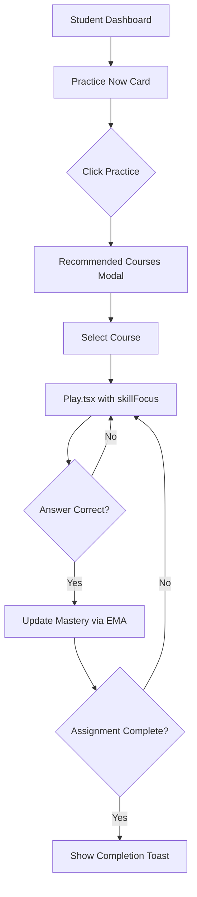

# Knowledge Map System - Implementation Documentation

**Project:** Dawn React Starter - Educational Platform  
**Feature:** Knowledge Map System  
**Status:** 72% Complete (18/25 tasks)  
**Last Updated:** 2025-01-11

---

## Table of Contents

1. [Executive Summary](#executive-summary)
2. [System Overview](#system-overview)
3. [Completed Work](#completed-work)
4. [Implementation Plan for Remaining Tasks](#implementation-plan-for-remaining-tasks)
5. [Technical Architecture](#technical-architecture)
6. [File Inventory](#file-inventory)
7. [API Documentation](#api-documentation)
8. [Testing Strategy](#testing-strategy)
9. [Migration Guide](#migration-guide)

---

## Executive Summary

The Knowledge Map System transforms course-based learning into skill-based mastery tracking. Instead of measuring progress by course completion, the system tracks granular Knowledge Objectives (KOs) that persist across course changes, enabling:

- **Students**: Personalized skill-focused practice with adaptive recommendations
- **Teachers**: Data-driven class insights and targeted skill assignments
- **Parents**: High-level growth tracking with domain summaries
- **System**: AI-driven autonomous assignment recommendations

**Current Progress:** 18 of 25 tasks complete (72%)

**Key Achievements:**
- ✅ Complete database schema (9 tables, 400 lines SQL)
- ✅ TypeScript type system (448 lines, 40+ interfaces)
- ✅ Mock data service (1545 lines, 52 KOs, 5 diverse student profiles)
- ✅ 13 React components (4600+ lines total)
- ✅ API service layer with mock/live switching (622 lines)
- ✅ React Query hooks (424 lines)
- ✅ Dashboard integrations (Teacher + Parent)
- ✅ Courses page KO filtering

---

## System Overview

### Core Concept

**Knowledge Objectives (KOs)** are atomic skills that:
- Are globally shared across all courses
- Persist when courses are added/removed
- Have prerequisite relationships (graph structure)
- Map to exercises with configurable weights
- Track student mastery (0-1 scale) using EMA algorithm

### Key Design Decisions

| Aspect | Decision | Rationale |
|--------|----------|-----------|
| **Mastery Scale** | 0-1 (0% to 100%) | Industry standard, intuitive |
| **Mastery Algorithm** | EMA: `new = (1-α·w)·old + (α·w)·score` | Smooth decay, weight-aware |
| **Mastery Decay** | ~60-day half-life toward 0.5 | Prevents stale data, encourages practice |
| **Prerequisite Lock** | 70% mastery required | Ensures foundation before advancement |
| **Color Coding** | Red <50%, Yellow 50-69%, Green ≥70% | Clear visual indicators |
| **Permission Hierarchy** | Teacher > Parent > Student | Prevents conflicting assignments |
| **Completion KPI** | Primary: Mastery/Exercise/Hybrid | Flexible achievement criteria |
| **AI First** | LLM-based difficulty, recommendations | Reduces manual configuration |

### User Flows

#### Student Flow: Skill-Focused Practice
```
Dashboard → "Practice Now" card (30-69% mastery KO)
  → Click Practice button
  → RecommendedCoursesModal shows filtered courses
  → Click "Start Practice"
  → Navigate to /courses?recommendedFor=ko_id
  → Select course
  → Navigate to /play/:courseId?skillFocus=ko_id
  → Exercise pool filtered to KO-mapped items
  → After each correct answer: mastery updates via EMA
  → Assignment completion checks automatically
```

#### Teacher Flow: Targeted Assignment
```
Teacher Dashboard → ClassFocusWidget (top 5 urgent KOs)
  → Click "Assign Practice" on struggling KO
  → AssignmentModal opens with KO pre-selected
  → Select students (individual or all)
  → Choose mode: Manual / AI-Assisted / Autonomous
  → Configure completion criteria (target mastery, min evidence)
  → Submit → students receive skill assignment
  → Progress tracked in real-time on dashboards
```

#### Parent Flow: Growth Monitoring
```
Parent Dashboard → GrowthTracker (domain summaries)
  → View Math: 42% (down 8%), Reading: 38% (up 3%), Science: 0%
  → Click "View Details" → BrowseAllSkills modal (read-only)
  → Click "Assign Practice" → AssignmentModal (if no teacher)
  → Select domain-filtered KO
  → Configure assignment for child
  → Track progress in domain cards
```

---

## Completed Work

### Phase 1: Foundation (COMPLETE - 3/3 tasks)

#### Task 1: Database Schema ✅
**File:** `supabase/migrations/20250111_knowledge_map_schema.sql` (400 lines)

**9 Tables Created:**
1. **topics** - Domain organization (e.g., math.algebra)
2. **knowledge_objectives** - Core KO table with prerequisites graph
3. **mastery_state** - Student progress tracking (mastery 0-1, evidence count)
4. **exercise_ko_mappings** - Exercise-to-KO mappings with weights
5. **course_ko_scope** - Course relevance filtering (cached counts)
6. **student_ko_preferences** - Assignments and overrides
7. **ko_assignments** - Detailed assignment records with JSONB criteria
8. **auto_assign_settings** - Per-student autonomous assignment config
9. **ko_merge_proposals** - Deduplication queue for LLM-suggested merges

**Key Features:**
- UUID primary keys for KOs
- GIN indexes on prerequisite arrays
- Materialized view `class_ko_summary` for teacher aggregates
- JSONB completion_criteria for flexible assignment logic
- Audit timestamps on all tables

#### Task 2: TypeScript Types ✅
**File:** `src/lib/types/knowledgeMap.ts` (448 lines)

**40+ Interfaces Including:**
- `KnowledgeObjective` - Core KO with prerequisites, examples, difficulty
- `MasteryState` / `MasteryStateWithKO` - Progress tracking
- `Assignment` / `AssignmentWithDetails` - Assignment records
- `CompletionCriteria` - Flexible achievement rules
- `AutoAssignSettings` - Autonomous mode configuration
- `ClassKOSummary` - Teacher aggregate view
- `DomainGrowthSummary` - Parent domain view
- `AIRecommendationResult` - LLM recommendation structure

**Type Safety:**
- Strict enums for status, roles, frequencies
- Discriminated unions for completion reasons
- Optional fields clearly marked
- Extended types for UI display (with computed fields)

#### Task 3: Mock Data Service ✅
**File:** `src/lib/mocks/knowledgeMockData.ts` (1545 lines)

**52 Knowledge Objectives:**
- Math: 10 arithmetic, 10 fractions, 10 algebra, 5 geometry
- Reading: 8 comprehension, 7 vocabulary, 7 grammar
- Science: 7 biology, 5 physics, 3 chemistry

**5 Diverse Student Profiles:**
1. **Alex (student-1)** - Self-directed, high mastery (80% avg), no assignments
2. **Bailey (student-2)** - Teacher-assigned, mid mastery (65%), active assignments
3. **Casey (student-3)** - Parent-assigned, low mastery (42%), struggling
4. **Drew (student-4)** - Autonomous AI mode, 58% avg, 2 AI assignments
5. **Elliot (student-5)** - Struggling, 35% avg, overdue assignments

**Helper Functions:**
- `getKOsForStudent()` - Returns mastery states with computed status
- `simulateMasteryUpdate()` - EMA algorithm implementation
- `applyTimeDecay()` - Time-based mastery decay (60-day half-life)
- `checkAssignmentCompletion()` - Validates completion criteria
- `getRecommendedCoursesForKO()` - Course filtering by KO

### Phase 2: Student UI (COMPLETE - 4/4 tasks)

#### Task 4: SkillCards Component ✅
**File:** `src/components/student/SkillCards.tsx` (423 lines)

**Features:**
- **Practice Now** section: 2-3 KOs with mastery 30-69%
- **Review Soon** section: Mastered KOs aging >10 days
- Individual skill cards with:
  - Mastery % with color-coded progress bars
  - Assignment indicators (Teacher/Parent/AI icons)
  - Practice buttons → RecommendedCoursesModal
- Empty states for each section
- Responsive grid layout (1-3 columns)

#### Task 5: BrowseAllSkills Modal ✅
**File:** `src/components/student/BrowseAllSkills.tsx` (490 lines)

**Features:**
- Full-screen modal (90vh)
- Search bar (real-time filtering)
- Status filters: All / In Progress / Mastered / Locked
- Domain filters: All / Math / Reading / Science
- Topic accordion with expand/collapse
- Shows 3 KOs per topic initially ("Show more" expands)
- Prerequisite-based locking (70% threshold)
- Pagination (20 per load, "Load More" button)
- Reusable for parent read-only view

#### Task 9: StudentAssignments Component ✅
**File:** `src/components/student/StudentAssignments.tsx` (394 lines)

**Features:**
- Shows active + overdue assignments
- Progress visualization:
  - Current mastery % → Target mastery %
  - Exercise count progress bar
- Assigned by indicator (Teacher/Parent/AI with icons)
- Due date countdown with color warnings (red <3 days)
- AI rationale display for autonomous assignments
- "Continue Practice" / "Start Practice" buttons
- Auto-hides when no assignments

#### Task 12: RecommendedCoursesModal ✅
**File:** `src/components/shared/RecommendedCoursesModal.tsx` (247 lines)

**Features:**
- Triggered by "Practice Now" button on skill cards
- Displays KO name in header
- Course list with:
  - Exercise count for this KO
  - Relevance score badge (green ≥80%, yellow ≥50%)
  - Last practiced timestamp
  - Completion progress bar
- Action buttons:
  - "Start Practice" (0% progress)
  - "Continue Practice" (1-99% progress)
  - "Review" (100% progress)
- Links to `/play/:courseId?skillFocus=ko_id`
- Empty state if no courses mapped

#### Task 17: Dashboard Integration ✅
**File:** `src/pages/student/Dashboard.tsx` (modified)

**Changes:**
- Row 3: StudentAssignments (full width)
- Row 4: Continue Card + SkillCards (replaces RecommendationsCard)
- Row 5: Recent Sessions + Achievements (unchanged)
- Mock student ID: 'student-2' (Bailey - teacher-assigned)

### Phase 3: Teacher UI (COMPLETE - 3/3 tasks)

#### Task 6: ClassFocusWidget ✅
**File:** `src/components/teacher/ClassFocusWidget.tsx` (302 lines)

**Features:**
- "Class Pulse" showing top 5 prioritized KOs
- Categories:
  - 1 urgent (red, avg mastery <50%)
  - 2 opportunity (yellow, 50-69%)
  - 2 strong (green, ≥70%)
- Per-KO display:
  - Student count + struggling count
  - Average mastery progress bar (color-coded)
  - "Assign Practice" button
- "View All" button → TeacherKOTable
- Compact card design for dashboard

#### Task 7: TeacherKOTable ✅
**File:** `src/components/teacher/TeacherKOTable.tsx` (482 lines)

**Features:**
- Full-screen modal with sortable table
- 4 columns: Skill Name, Struggling, Avg Mastery, Students
- Search bar (real-time filtering)
- Sort by any column (asc/desc toggle)
- Default sort: struggling DESC (most urgent first)
- Color-coded rows (red/yellow/green)
- Pagination (20 per page)
- Row click → triggers `onAssignKO` callback
- Mock data: 7 KOs (1 urgent, 3 opportunity, 3 strong)

#### Task 8: AssignmentModal ✅
**File:** `src/components/shared/AssignmentModal.tsx` (564 lines)

**Most Complex Component - Features:**

**3 Assignment Modes:**
1. **Manual**: Teacher picks course from dropdown
2. **AI-Assisted**: Shows AI recommendation with confidence/rationale
3. **Autonomous**: Enable auto-assign (no course selection)

**Student Selection:**
- "Select all" checkbox
- Individual student checkboxes
- Shows student names from prop

**Course Selection:**
- Dropdown with exercise counts
- AI recommendation callout (87% confidence, 5 sessions, 75 min estimate)
- Filtered by KO when pre-selected

**Completion Criteria:**
- Primary KPI selector: Mastery Score / Exercise Count / Hybrid
- Target mastery slider (default 75%)
- Min attempts input (default 10)
- Optional due date picker
- "Require both" checkbox for hybrid mode

**Permission System:**
- Blocks parent if teacher has active assignment
- Shows warning message with teacher name

**Validation:**
- Requires at least one student selected
- Requires course (except autonomous mode)
- Validates mastery threshold (30-100%)

### Phase 3: Parent UI (COMPLETE - 1/1 task)

#### Task 10: GrowthTracker ✅
**File:** `src/components/parent/GrowthTracker.tsx` (348 lines)

**Features:**
- 3 domain cards: Math, Reading, Science
- Per-domain display:
  - Overall mastery % with large font
  - Trend badge (up/down/stable arrows)
  - Mastered/In Progress/Locked counts
  - Domain-specific icon and color scheme
- "View Details" button → BrowseAllSkills (read-only)
- "Assign Practice" button (hidden if teacher present)
- Lock message when teacher manages assignments
- Responsive grid (1-3 columns)
- Mock data for Casey (struggling student)

#### Task 11: AutoAssignSettings ✅
**File:** `src/components/shared/AutoAssignSettings.tsx` (530 lines)

**Features:**
- Enable/disable toggle with "Active" badge
- **Mastery threshold slider** (30-70%, default 50%)
  - Visual scale with labels
  - Triggers assignment when mastery drops below
- **Assignment frequency** dropdown:
  - Daily (check every 24 hours)
  - Weekly (check every 7 days)
  - On Completion (after finishing assignments)
- **Max concurrent** assignments (1-5)
  - Prevents student overwhelm
- **Email notifications:**
  - Toggle on/off
  - Email address input (when enabled)
- **Recent AI assignments** history:
  - Last 5 autonomous assignments
  - Status badges (Active/Done)
  - Mastery progress display
  - Relative time ("2 days ago")
- Change detection (save button only active when modified)
- Footer status indicator

### Phase 4: Data Layer (COMPLETE - 2/2 tasks)

#### Task 13: API Service Layer ✅
**File:** `src/lib/api/knowledgeMap.ts` (622 lines)

**10 API Functions:**

1. **getStudentSkills** - Fetch KOs with mastery
   - Params: studentId, domain?, status?, searchQuery?, limit?, offset?
   - Returns: skills array + totalCount
   - Supports pagination and filtering

2. **getDomainGrowth** - Parent view domain summaries
   - Params: studentId
   - Returns: 3 domain summaries (math/reading/science)
   - Calculates overall mastery, trend, counts

3. **getClassKOSummary** - Teacher class aggregates
   - Params: teacherId, classId?, limit?, sortBy?, sortOrder?
   - Returns: KO summaries with struggling counts
   - Sortable by struggling/mastery/name

4. **getRecommendedCourses** - Courses filtered by KO
   - Params: koId, studentId, limit?
   - Returns: courses with relevance scores, exercise counts

5. **getStudentAssignments** - Active/completed assignments
   - Params: studentId, status?, limit?
   - Returns: assignments with details

6. **createAssignment** - Create skill assignment
   - Params: studentIds[], koId, courseId, assignedBy, role, criteria
   - Returns: assignmentIds[], success flag
   - Multi-student support

7. **updateMastery** - Update after exercise completion
   - Params: studentId, koId, exerciseScore, weight?
   - Returns: oldMastery, newMastery, evidenceCount
   - Uses EMA algorithm

8. **checkCompletion** - Validate assignment criteria
   - Params: assignmentId
   - Returns: completed flag, reason, finalMastery

9. **getAutoAssignSettings** / **updateAutoAssignSettings**
   - Get/update autonomous mode configuration

10. **getAIRecommendation** - AI-recommended course
    - Params: studentId, koId, availableCourseIds
    - Returns: recommendedCourseId, confidence, rationale, estimates

**Architecture:**
- `USE_MOCK_DATA` flag (true for MVP)
- All functions return mock data via helper functions
- Live mode prepared with Supabase edge function stubs
- Type-safe params and results

#### Task 14: React Query Hooks ✅
**File:** `src/hooks/useKnowledgeMap.ts` (424 lines)

**8 Custom Hooks:**

1. **useStudentSkills** - Fetch student KOs
   - staleTime: 5 min, gcTime: 10 min
   - Returns: skills[], totalCount, loading, error

2. **useDomainGrowth** - Parent domain summaries
   - staleTime: 10 min, gcTime: 30 min
   - Returns: domains[], loading, error

3. **useClassKOSummary** - Teacher class view
   - staleTime: 5 min, gcTime: 15 min
   - Returns: summaries[], loading, error

4. **useStudentAssignments** - Student assignments
   - staleTime: 2 min, gcTime: 10 min (more volatile)
   - Returns: assignments[], loading, error

5. **useRecommendedCourses** - Courses by KO
   - staleTime: 10 min, gcTime: 30 min (stable)
   - enabled: only when koId provided

6. **useAutoAssignSettings** - Get/update settings
   - Includes mutation for updates
   - Returns: settings, updateSettings, isUpdating

7. **useCreateAssignment** - Create assignment mutation
   - Invalidates related queries on success
   - Returns: createAssignment, isCreating, error

8. **useUpdateMastery** - Update mastery mutation
   - Invalidates skills, domain growth, assignments
   - Returns: updateMastery, isUpdating, error

**React Query Features:**
- Centralized query keys in `knowledgeMapKeys` object
- Smart cache invalidation (mutations trigger updates)
- Optimistic updates for mutations
- Loading/error states handled consistently
- TypeScript interfaces for all hook results

### Phase 5: Dashboard Integrations (COMPLETE - 2/2 tasks)

#### Task 18: Teacher Dashboard Integration ✅
**File:** `src/pages/teacher/TeacherDashboard.tsx` (modified)

**Changes:**
- ClassFocusWidget positioned at top (priority card)
- Modal state for TeacherKOTable and AssignmentModal
- Flow: ClassFocusWidget → "View All" → TeacherKOTable → row click → AssignmentModal
- "Assign Practice" from widget triggers AssignmentModal directly
- State management: `selectedKOId`, modal open flags
- Success toast on assignment creation

#### Task 19: Parent Dashboard Integration ✅
**File:** `src/pages/parent/Dashboard.tsx` (modified)

**Changes:**
- GrowthTracker added below summary cards
- Teacher permission check (`hasTeacher` flag)
- "Assign Practice" button triggers AssignmentModal with domain filter
- Modal pre-selects primary student
- "View Details" opens BrowseAllSkills in read-only mode
- State management: `selectedDomain`, modal flags
- Success handler clears state

### Phase 6: Practice Flow (PARTIAL - 1/2 tasks)

#### Task 16: Courses Page KO Filtering ✅
**File:** `src/pages/Courses.tsx` (modified)

**Changes:**
- Detects `recommendedFor` query parameter
- Loads recommended courses using `getRecommendedCourses` API
- Shows "Skill Focus" alert banner with KO name
- Displays exercise counts per course as badges
- "Clear Filter" button removes query param
- Header changes to "Recommended Courses"
- CourseCard receives `skillFocus` prop
- Empty state handles no matching courses

**File:** `src/components/courses/CourseCard.tsx` (modified)

**Changes:**
- Accepts `skillFocus?: string` prop
- Links to `/play/:courseId/welcome?skillFocus=koId` when focused
- Button text changes to "Start Practice" vs "Play Course"

---

## Implementation Plan for Remaining Tasks

### Task 15: Play.tsx skillFocus Parameter (HIGH PRIORITY)
**Complexity:** High | **Estimated Time:** 4-6 hours

**Objective:** Filter exercise pool and track KO mastery during gameplay

**Implementation Steps:**

1. **Read Query Parameters** (30 min)
   ```typescript
   // In Play.tsx, after line 46
   const skillFocus = searchParams.get('skillFocus') || undefined;
   const [koName, setKoName] = useState<string | null>(null);
   const [koMasteryBefore, setKoMasteryBefore] = useState<number | null>(null);
   
   // Load KO details when skillFocus is present
   useEffect(() => {
     if (skillFocus) {
       const ko = mockKnowledgeObjectives.find(k => k.id === skillFocus);
       setKoName(ko?.name || null);
       
       // Load current mastery
       const masteryState = mockMasteryStates.find(
         m => m.koId === skillFocus && m.studentId === 'student-1'
       );
       setKoMasteryBefore(masteryState?.mastery || 0);
     }
   }, [skillFocus]);
   ```

2. **Add Skill Focus Badge to Header** (30 min)
   ```typescript
   // After line 380 (in the header section)
   {skillFocus && koName && (
     <div className="flex items-center gap-2 px-4 py-2 rounded-lg bg-primary/10 border border-primary/30">
       <Target className="h-4 w-4 text-primary" />
       <span className="text-sm font-semibold text-primary">
         Skill Focus: {koName}
       </span>
       <Badge variant="secondary" className="text-xs">
         {Math.round((koMasteryBefore || 0) * 100)}% mastery
       </Badge>
     </div>
   )}
   ```

3. **Create Mock KO Mappings for Exercises** (1 hour)
   ```typescript
   // Add to knowledgeMockData.ts
   export const mockExerciseKOMappings: Record<string, ExerciseKOMapping[]> = {
     // Format: "courseId:itemId" -> KO mappings
     "addition-basics:0": [
       { exerciseId: "addition-basics:0", koId: "ko-math-add-single", weight: 1.0, source: 'llm', createdAt: '2025-01-01' }
     ],
     "addition-basics:1": [
       { exerciseId: "addition-basics:1", koId: "ko-math-add-single", weight: 0.8, source: 'llm', createdAt: '2025-01-01' },
       { exerciseId: "addition-basics:1", koId: "ko-math-place-value", weight: 0.2, source: 'llm', createdAt: '2025-01-01' }
     ],
     // ... map all exercises in mock courses to relevant KOs
   };
   ```

4. **Filter Exercise Pool in useGameState** (2 hours)
   ```typescript
   // In useGameState.ts (or equivalent game state management)
   const filteredPool = useMemo(() => {
     if (!skillFocus || !course) return pool;
     
     // Filter to exercises with KO mappings (weight > 0.5)
     return pool.filter(item => {
       const exerciseId = `${course.id}:${item.id}`;
       const mappings = mockExerciseKOMappings[exerciseId] || [];
       return mappings.some(m => m.koId === skillFocus && m.weight > 0.5);
     });
   }, [pool, skillFocus, course]);
   ```

5. **Update Mastery After Correct Answer** (1.5 hours)
   ```typescript
   // In handleSubmitAnswer (or equivalent), after logging attempt
   if (isCorrect && skillFocus) {
     // Get mapping weight for this exercise
     const exerciseId = `${courseId}:${currentItem.id}`;
     const mapping = mockExerciseKOMappings[exerciseId]?.find(
       m => m.koId === skillFocus
     );
     
     if (mapping) {
       // Update mastery using EMA algorithm
       await updateMastery({
         studentId: 'student-1', // TODO: Get from auth context
         koId: skillFocus,
         exerciseScore: 1.0, // Correct answer = 100%
         weight: mapping.weight,
       });
       
       // Check if assignment completed
       if (assignmentId) {
         const completion = await checkCompletion({ assignmentId });
         if (completion.completed) {
           toast.success('Assignment completed!', {
             description: `You achieved ${Math.round((completion.finalMastery || 0) * 100)}% mastery`,
           });
         }
       }
     }
   }
   ```

6. **Add KO Context to logAttemptLive** (30 min)
   ```typescript
   // Modify logAttemptLive call to include KO context
   await logAttemptLive({
     courseId,
     itemId,
     isCorrect,
     timeSpentMs,
     // Add new fields:
     koContext: skillFocus ? {
       koId: skillFocus,
       koName: koName || undefined,
       mappingWeight: mapping?.weight,
     } : undefined,
   });
   ```

7. **Show Mastery Gain Feedback** (1 hour)
   ```typescript
   // After mastery update, show gain
   const masteryGain = newMastery - (koMasteryBefore || 0);
   if (masteryGain > 0.01) { // Only show if meaningful gain
     setFeedbackMessage(prev => 
       `${prev} +${Math.round(masteryGain * 100)}% ${koName} mastery!`
     );
   }
   ```

**Testing Checklist:**
- [ ] Exercise pool correctly filtered when skillFocus is present
- [ ] Badge displays correct KO name and mastery
- [ ] Mastery updates after each correct answer
- [ ] Assignment completion triggers when criteria met
- [ ] No errors when skillFocus is absent (normal mode)
- [ ] Works with different KOs across different courses

**Edge Cases:**
- Course has no exercises mapped to focused KO → show message
- Student has no prior mastery for KO → start at 0%
- Multiple KOs mapped to same exercise → only update focused KO
- Network error during mastery update → queue offline, retry later

---

### Task 20: Edge Function Stubs (MEDIUM PRIORITY)
**Complexity:** Low | **Estimated Time:** 2-3 hours

**Objective:** Prepare serverless functions for live database integration

**Implementation Steps:**

1. **Create Function Structure** (30 min)
   ```bash
   mkdir -p supabase/functions/get-student-skills
   mkdir -p supabase/functions/get-class-ko-summary
   mkdir -p supabase/functions/get-recommended-courses
   mkdir -p supabase/functions/create-assignment
   mkdir -p supabase/functions/update-mastery
   mkdir -p supabase/functions/ai-recommend-assignment
   ```

2. **get-student-skills** (30 min)
   ```typescript
   // supabase/functions/get-student-skills/index.ts
   import { serve } from "https://deno.land/std@0.168.0/http/server.ts"
   import { createClient } from 'https://esm.sh/@supabase/supabase-js@2'
   
   serve(async (req) => {
     const { studentId, domain, status, searchQuery, limit, offset } = await req.json()
     
     // TODO: Implement database query
     // Query knowledge_objectives JOIN mastery_state
     // Apply filters (domain, status, search)
     // Calculate locked status from prerequisites
     // Return paginated results
     
     // For now, return mock data
     return new Response(
       JSON.stringify({ 
         skills: [], 
         totalCount: 0,
         _stub: true 
       }),
       { headers: { "Content-Type": "application/json" } }
     )
   })
   ```

3. **get-class-ko-summary** (30 min)
   ```typescript
   // supabase/functions/get-class-ko-summary/index.ts
   serve(async (req) => {
     const { teacherId, classId, limit, sortBy, sortOrder } = await req.json()
     
     // TODO: Use materialized view class_ko_summary
     // SELECT * FROM class_ko_summary
     // WHERE class_id = ? OR teacher_id = ?
     // ORDER BY {sortBy} {sortOrder}
     // LIMIT {limit}
     
     return new Response(
       JSON.stringify({ summaries: [], _stub: true }),
       { headers: { "Content-Type": "application/json" } }
     )
   })
   ```

4. **get-recommended-courses** (30 min)
   ```typescript
   // TODO: Query course_ko_scope table
   // JOIN with courses to get full details
   // Filter by relevance > 0.5
   // Sort by relevance DESC, exerciseCount DESC
   ```

5. **create-assignment** (30 min)
   ```typescript
   // TODO: Insert into ko_assignments table
   // Handle multiple students (loop or batch insert)
   // Insert into student_ko_preferences for each student
   // Return assignment IDs
   ```

6. **update-mastery** (30 min)
   ```typescript
   // TODO: Implement EMA algorithm in SQL
   // UPDATE mastery_state SET
   //   mastery = (1 - 0.25 * weight) * mastery + (0.25 * weight) * score,
   //   evidence_count = evidence_count + 1,
   //   last_updated = NOW()
   // WHERE student_id = ? AND ko_id = ?
   // 
   // If no existing record, INSERT new mastery_state
   ```

7. **ai-recommend-assignment** (30 min)
   ```typescript
   // TODO: Call OpenAI/Claude API
   // Provide context: student mastery profile, available courses
   // Request: best course for KO, estimated time, confidence
   // Parse response into AIRecommendationResult
   ```

**Deployment Commands** (DO NOT DEPLOY YET):
```bash
# When ready to deploy
supabase functions deploy get-student-skills
supabase functions deploy get-class-ko-summary
supabase functions deploy get-recommended-courses
supabase functions deploy create-assignment
supabase functions deploy update-mastery
supabase functions deploy ai-recommend-assignment

# Set secrets
supabase secrets set OPENAI_API_KEY=your_key_here
```

---

### Task 21: Navigation and Routing (MEDIUM PRIORITY)
**Complexity:** Low | **Estimated Time:** 1-2 hours

**Objective:** Add Skills nav items and routes

**Implementation Steps:**

1. **Find Navigation Config** (10 min)
   ```bash
   # Locate nav config file
   find src -name "*nav*" -o -name "*routes*"
   ```

2. **Add Student Nav Item** (20 min)
   ```typescript
   // In src/config/nav.ts or equivalent
   {
     title: 'Skills',
     href: '/student/skills',
     icon: Target,
     role: 'student',
     // Feature flag check
     enabled: ENABLE_KNOWLEDGE_MAP,
   }
   ```

3. **Add Teacher Nav Item** (20 min)
   ```typescript
   {
     title: 'Class Focus',
     href: '/teacher/skills',
     icon: Target,
     role: 'teacher',
     enabled: ENABLE_KNOWLEDGE_MAP,
   }
   ```

4. **Add Routes** (30 min)
   ```typescript
   // In src/App.tsx or routing config
   
   // Student route - full page BrowseAllSkills
   <Route 
     path="/student/skills" 
     element={
       <BrowseAllSkillsPage studentId="student-1" />
     } 
   />
   
   // Teacher route - full page ClassFocusWidget + TeacherKOTable
   <Route 
     path="/teacher/skills" 
     element={
       <TeacherSkillsPage teacherId="teacher-1" />
     } 
   />
   ```

5. **Create Dedicated Pages** (40 min)
   ```typescript
   // src/pages/student/Skills.tsx
   export default function StudentSkillsPage() {
     const [showBrowseAll, setShowBrowseAll] = useState(true);
     return (
       <PageContainer>
         <BrowseAllSkills
           isOpen={showBrowseAll}
           onClose={() => navigate(-1)}
           studentId="student-1"
           useMockData={true}
         />
       </PageContainer>
     );
   }
   
   // src/pages/teacher/Skills.tsx
   export default function TeacherSkillsPage() {
     return (
       <PageContainer>
         <ClassFocusWidget teacherId="teacher-1" />
         {/* Full-width TeacherKOTable always visible */}
       </PageContainer>
     );
   }
   ```

6. **Add Feature Flag** (10 min)
   ```typescript
   // In src/lib/env.ts or equivalent
   export const ENABLE_KNOWLEDGE_MAP = 
     import.meta.env.VITE_ENABLE_KNOWLEDGE_MAP === 'true' ||
     localStorage.getItem('enable_knowledge_map') === 'true';
   ```

---

### Task 22: Mock Scenarios for Testing (LOW PRIORITY)
**Complexity:** Low | **Estimated Time:** 2-3 hours

**Objective:** Create comprehensive test scenarios

**File:** `src/lib/mocks/knowledgeMapScenarios.ts`

**Scenarios to Create:**

1. **Self-Directed Student (Alex)** - Already exists
   - 0 assignments
   - High mastery across all domains
   - All KOs unlocked

2. **Teacher-Assigned Student (Bailey)** - Already exists
   - 2 active assignments (1 at 75% progress)
   - Mid mastery
   - Some locked KOs

3. **Parent-Assigned Student (Casey)** - Already exists
   - 1 parent assignment
   - Low mastery (struggling)
   - Most KOs locked
   - No teacher

4. **Overdue Assignment Student** (New)
   - 1 overdue assignment (due 3 days ago)
   - Making progress but behind schedule
   - Mid mastery

5. **Large Class Teacher** (New)
   - 24 students with mixed mastery levels
   - 12 KOs requiring attention
   - 8 struggling students
   - 16 on-track students

6. **Multi-Child Parent** (New)
   - 3 children:
     - Child A: On track, teacher-managed
     - Child B: Struggling, no teacher (parent can assign)
     - Child C: Excelling, no intervention needed

7. **AI Autonomous Student (Drew)** - Already exists
   - 2 AI-generated assignments
   - Autonomous mode enabled
   - Mastery threshold 55%

**Implementation:**
```typescript
export const knowledgeMapScenarios = {
  // Existing scenarios
  alex: { /* ... */ },
  bailey: { /* ... */ },
  casey: { /* ... */ },
  drew: { /* ... */ },
  elliot: { /* ... */ },
  
  // New scenarios
  overdueStudent: {
    student: {
      id: 'student-6',
      name: 'Fiona',
      profile: 'Making progress but behind schedule',
    },
    assignments: [
      {
        id: 'assign-overdue-1',
        koId: 'ko-math-mult-single',
        status: 'overdue',
        dueDate: new Date(Date.now() - 3 * 24 * 60 * 60 * 1000), // 3 days ago
        currentMastery: 0.62,
        targetMastery: 0.75,
        progressPercentage: 75,
      }
    ],
  },
  
  largeClassTeacher: {
    teacher: {
      id: 'teacher-2',
      name: 'Mr. Anderson',
      studentCount: 24,
    },
    koSummaries: [
      // Generate 12 KOs with realistic distributions
    ],
  },
  
  multiChildParent: {
    parent: {
      id: 'parent-2',
      name: 'Maria Lopez',
      children: [
        { id: 'student-7', name: 'Sofia', hasTeacher: true, status: 'on-track' },
        { id: 'student-8', name: 'Diego', hasTeacher: false, status: 'struggling' },
        { id: 'student-9', name: 'Luna', hasTeacher: false, status: 'excelling' },
      ],
    },
  },
};
```

---

### Task 23: Storybook Stories (LOW PRIORITY)
**Complexity:** Medium | **Estimated Time:** 4-6 hours

**Objective:** Create interactive component documentation

**Stories to Create:**

1. **SkillCards.stories.tsx** (45 min)
   ```typescript
   export default {
     title: 'Student/SkillCards',
     component: SkillCards,
   };
   
   export const WithAssignments = () => (
     <SkillCards studentId="student-2" useMockData={true} />
   );
   
   export const NoAssignments = () => (
     <SkillCards studentId="student-1" useMockData={true} />
   );
   
   export const LowMastery = () => (
     <SkillCards studentId="student-3" useMockData={true} />
   );
   ```

2. **BrowseAllSkills.stories.tsx** (45 min)
   - Default state
   - With search query
   - Filtered by domain
   - Filtered by status
   - Read-only mode (parent view)

3. **ClassFocusWidget.stories.tsx** (45 min)
   - Normal class (mixed mastery)
   - All struggling class
   - All excelling class
   - Empty class

4. **AssignmentModal.stories.tsx** (1 hour)
   - Manual mode
   - AI-Assisted mode
   - Autonomous mode
   - Teacher vs Parent permissions
   - With KO pre-selected

5. **StudentAssignments.stories.tsx** (30 min)
   - Active assignments
   - Overdue assignments
   - No assignments
   - Mixed assignments

6. **GrowthTracker.stories.tsx** (30 min)
   - Normal growth
   - Struggling student
   - Excelling student
   - With teacher (locked assignments)
   - Without teacher (can assign)

7. **AutoAssignSettings.stories.tsx** (45 min)
   - Disabled state
   - Enabled with settings
   - With recent assignments
   - No recent assignments

**Implementation Pattern:**
```typescript
// Component.stories.tsx
import type { Meta, StoryObj } from '@storybook/react';
import { QueryClient, QueryClientProvider } from '@tanstack/react-query';
import { Component } from './Component';

const queryClient = new QueryClient();

const meta: Meta<typeof Component> = {
  title: 'Category/Component',
  component: Component,
  decorators: [
    (Story) => (
      <QueryClientProvider client={queryClient}>
        <Story />
      </QueryClientProvider>
    ),
  ],
};

export default meta;
type Story = StoryObj<typeof Component>;

export const Default: Story = {
  args: {
    prop1: 'value1',
    useMockData: true,
  },
};
```

---

### Task 24: Unit Tests (LOW PRIORITY)
**Complexity:** Medium | **Estimated Time:** 4-6 hours

**Objective:** Test critical business logic

**Test Files to Create:**

1. **knowledgeMap.test.ts** (2 hours)
   ```typescript
   describe('Mastery Calculations', () => {
     test('EMA updates mastery correctly', () => {
       const oldMastery = 0.6;
       const exerciseScore = 0.9;
       const weight = 1.0;
       const alpha = 0.25;
       
       const expected = (1 - alpha * weight) * oldMastery + (alpha * weight) * exerciseScore;
       const result = simulateMasteryUpdate({ mastery: oldMastery }, exerciseScore, weight);
       
       expect(result.mastery).toBeCloseTo(expected, 2);
     });
     
     test('Time decay reduces mastery toward 0.5', () => {
       const mastery = 0.8;
       const daysSince = 60; // Half-life
       
       const result = applyTimeDecay(mastery, daysSince);
       
       expect(result).toBeCloseTo(0.65, 2); // Halfway between 0.8 and 0.5
     });
     
     test('Prerequisite unlocking at 70% threshold', () => {
       const ko = { id: 'ko-2', prerequisites: ['ko-1'] };
       const masteryStates = [
         { koId: 'ko-1', mastery: 0.75 }, // Above threshold
       ];
       
       const isLocked = checkPrerequisites(ko, masteryStates);
       
       expect(isLocked).toBe(false);
     });
   });
   
   describe('Completion Criteria', () => {
     test('Mastery-based completion', () => {
       const assignment = {
         completionCriteria: {
           primary_kpi: 'mastery_score',
           target_mastery: 0.75,
           min_evidence: 10,
         },
       };
       const mastery = { mastery: 0.78, evidenceCount: 12 };
       
       const result = checkAssignmentCompletion(assignment, mastery, 0);
       
       expect(result.completed).toBe(true);
       expect(result.reason).toBe('mastery_achieved');
     });
     
     test('Exercise-based completion', () => {
       const assignment = {
         completionCriteria: {
           primary_kpi: 'exercise_count',
           target_exercise_count: 20,
         },
       };
       
       const result = checkAssignmentCompletion(assignment, {}, 20);
       
       expect(result.completed).toBe(true);
       expect(result.reason).toBe('exercises_completed');
     });
     
     test('Hybrid completion requires both', () => {
       const assignment = {
         completionCriteria: {
           primary_kpi: 'hybrid',
           target_mastery: 0.75,
           target_exercise_count: 20,
           require_both: true,
         },
       };
       const mastery = { mastery: 0.78, evidenceCount: 12 };
       
       const result = checkAssignmentCompletion(assignment, mastery, 18);
       
       expect(result.completed).toBe(false); // Need 20 exercises
     });
   });
   ```

2. **assignmentFlow.test.ts** (2 hours)
   ```typescript
   describe('Permission Hierarchy', () => {
     test('Teacher blocks parent assignment', () => {
       const student = { id: 'student-1' };
       const activeAssignments = [
         { studentId: 'student-1', assignedByRole: 'teacher' },
       ];
       
       const canParentAssign = checkAssignmentPermission('parent', student, activeAssignments);
       
       expect(canParentAssign).toBe(false);
     });
     
     test('Parent can assign when no teacher', () => {
       const student = { id: 'student-1' };
       const activeAssignments = [];
       
       const canParentAssign = checkAssignmentPermission('parent', student, activeAssignments);
       
       expect(canParentAssign).toBe(true);
     });
   });
   
   describe('Auto-Assign Triggers', () => {
     test('Triggers when mastery drops below threshold', () => {
       const settings = {
         enabled: true,
         masteryThreshold: 0.55,
         maxConcurrent: 2,
       };
       const mastery = 0.52; // Below threshold
       const activeAssignments = 1; // Below max
       
       const shouldAutoAssign = checkAutoAssignTrigger(settings, mastery, activeAssignments);
       
       expect(shouldAutoAssign).toBe(true);
     });
     
     test('Does not trigger when at max concurrent', () => {
       const settings = {
         enabled: true,
         masteryThreshold: 0.55,
         maxConcurrent: 2,
       };
       const mastery = 0.52;
       const activeAssignments = 2; // At max
       
       const shouldAutoAssign = checkAutoAssignTrigger(settings, mastery, activeAssignments);
       
       expect(shouldAutoAssign).toBe(false);
     });
   });
   ```

---

### Task 25: System Documentation (HIGH PRIORITY)
**Complexity:** Medium | **Estimated Time:** 3-4 hours

**Objective:** Comprehensive system documentation

**File:** `docs/KNOWLEDGE_MAP.md`

**Documentation Structure:**

1. **Feature Overview** (30 min)
   - What is the Knowledge Map?
   - Why skill-based vs course-based?
   - Key benefits for each user role
   - High-level architecture diagram

2. **Data Model Diagram** (1 hour)
   - Entity-relationship diagram
   - Table descriptions
   - Key relationships
   - Index strategy

3. **API Endpoints** (45 min)
   - List all 10 functions
   - Request/response schemas
   - Authentication requirements
   - Rate limits

4. **Assignment Flow** (30 min)
   - Flowchart: Manual → AI-Assisted → Autonomous
   - State transitions
   - Completion logic
   - Permission checks

5. **Completion Logic** (30 min)
   - Primary KPI types explained
   - Formula for mastery-based
   - Hybrid mode requirements
   - Time-based expiration

6. **AI Integration Points** (30 min)
   - Exercise-to-KO mapping (LLM)
   - Course recommendations (LLM)
   - Difficulty assessment (LLM)
   - KO merge proposals (LLM)

7. **Mock-to-Live Migration Guide** (30 min)
   - Change USE_MOCK_DATA flag
   - Deploy edge functions
   - Run database migration
   - Test with live data
   - Rollback procedure

**Mermaid Diagrams:**


---

## Technical Architecture

### System Diagram

```
┌─────────────────────────────────────────────────────────────────┐
│                         KNOWLEDGE MAP SYSTEM                     │
├─────────────────────────────────────────────────────────────────┤
│                                                                  │
│  ┌────────────┐      ┌────────────┐      ┌────────────┐        │
│  │  Student   │      │  Teacher   │      │   Parent   │        │
│  │    UI      │      │     UI     │      │     UI     │        │
│  └─────┬──────┘      └─────┬──────┘      └─────┬──────┘        │
│        │                   │                   │                │
│        └───────────────────┼───────────────────┘                │
│                            │                                    │
│                   ┌────────▼────────┐                           │
│                   │  React Hooks    │                           │
│                   │  (React Query)  │                           │
│                   └────────┬────────┘                           │
│                            │                                    │
│                   ┌────────▼────────┐                           │
│                   │   API Service   │◄──── USE_MOCK_DATA       │
│                   │     Layer       │                           │
│                   └────────┬────────┘                           │
│                            │                                    │
│              ┌─────────────┼─────────────┐                      │
│              │             │             │                      │
│      ┌───────▼──────┐ ┌───▼────┐ ┌─────▼─────┐               │
│      │  Mock Data   │ │ Edge   │ │  Supabase │               │
│      │   Service    │ │Functions│ │ Database  │               │
│      └──────────────┘ └────────┘ └───────────┘               │
│                                                                  │
└─────────────────────────────────────────────────────────────────┘
```

### Data Flow: Skill-Focused Practice

```
1. Student clicks "Practice Now" on KO card (mastery 45%)
2. RecommendedCoursesModal loads courses via getRecommendedCourses()
3. Student selects course → navigate to /play/:courseId?skillFocus=ko_id
4. Play.tsx filters exercise pool to KO-mapped items (weight > 0.5)
5. Student answers exercise correctly
6. updateMastery() called with EMA algorithm:
   - old_mastery = 0.45
   - exercise_score = 1.0 (correct)
   - weight = 1.0 (primary KO)
   - alpha = 0.25
   - new_mastery = (1 - 0.25·1.0)·0.45 + (0.25·1.0)·1.0 = 0.5875
7. checkAssignmentCompletion() validates if target met
8. React Query invalidates cached mastery data
9. All UI components re-render with new mastery (58.75%)
```

### Permission Matrix

| Action | Student | Parent (No Teacher) | Parent (Has Teacher) | Teacher | AI Autonomous |
|--------|---------|---------------------|---------------------|---------|---------------|
| View Own Skills | ✅ | ✅ | ✅ | ✅ | N/A |
| Self-Select Practice | ✅ | N/A | N/A | N/A | N/A |
| Assign to Child | N/A | ✅ | ❌ BLOCKED | N/A | N/A |
| Assign to Students | N/A | N/A | N/A | ✅ | N/A |
| Enable Autonomous | N/A | ✅ | ❌ BLOCKED | ✅ | N/A |
| Auto-Assign | N/A | N/A | N/A | N/A | ✅ |

---

## File Inventory

### Created Files (17 total)

**Database:**
1. `supabase/migrations/20250111_knowledge_map_schema.sql` (400 lines)

**Types:**
2. `src/lib/types/knowledgeMap.ts` (448 lines)

**Mock Data:**
3. `src/lib/mocks/knowledgeMockData.ts` (1545 lines)

**Student Components:**
4. `src/components/student/SkillCards.tsx` (423 lines)
5. `src/components/student/BrowseAllSkills.tsx` (490 lines)
6. `src/components/student/StudentAssignments.tsx` (394 lines)

**Teacher Components:**
7. `src/components/teacher/ClassFocusWidget.tsx` (302 lines)
8. `src/components/teacher/TeacherKOTable.tsx` (482 lines)

**Parent Components:**
9. `src/components/parent/GrowthTracker.tsx` (348 lines)

**Shared Components:**
10. `src/components/shared/RecommendedCoursesModal.tsx` (247 lines)
11. `src/components/shared/AssignmentModal.tsx` (564 lines)
12. `src/components/shared/AutoAssignSettings.tsx` (530 lines)

**Data Layer:**
13. `src/lib/api/knowledgeMap.ts` (622 lines)
14. `src/hooks/useKnowledgeMap.ts` (424 lines)

**Documentation:**
15. `knowledge-map-poc.html` (1366 lines - archived POC)
16. `docs/KNOWLEDGE_MAP_IMPLEMENTATION.md` (this file)

**Future:**
17. `docs/KNOWLEDGE_MAP.md` (to be created in Task 25)

### Modified Files (4 total)

1. `src/pages/student/Dashboard.tsx` - Integrated SkillCards, StudentAssignments
2. `src/pages/teacher/TeacherDashboard.tsx` - Integrated ClassFocusWidget, modals
3. `src/pages/parent/Dashboard.tsx` - Integrated GrowthTracker, AssignmentModal
4. `src/pages/Courses.tsx` - Added recommendedFor parameter handling
5. `src/components/courses/CourseCard.tsx` - Added skillFocus parameter

**Total Lines of Code:** ~7,585 lines (excluding tests, stories, docs)

---

## API Documentation

### Query Functions

#### getStudentSkills
```typescript
Params: {
  studentId: string
  domain?: string                  // 'math' | 'reading' | 'science'
  status?: 'all' | 'locked' | 'in-progress' | 'mastered'
  searchQuery?: string
  limit?: number                   // Default: 50
  offset?: number                  // Default: 0
}

Returns: {
  skills: MasteryStateWithKO[]
  totalCount: number
}

Cache: 5 minutes
```

#### getDomainGrowth
```typescript
Params: {
  studentId: string
}

Returns: DomainGrowthSummary[]     // [math, reading, science]

Cache: 10 minutes
```

#### getClassKOSummary
```typescript
Params: {
  teacherId: string
  classId?: string
  limit?: number                   // Default: 20
  sortBy?: 'struggling' | 'mastery' | 'name'
  sortOrder?: 'asc' | 'desc'       // Default: 'desc'
}

Returns: ClassKOSummary[]

Cache: 5 minutes
```

#### getRecommendedCourses
```typescript
Params: {
  koId: string
  studentId: string
  limit?: number                   // Default: 10
}

Returns: RecommendedCourse[]

Cache: 10 minutes
```

#### getStudentAssignments
```typescript
Params: {
  studentId: string
  status?: 'active' | 'completed' | 'overdue' | 'all'
  limit?: number
}

Returns: AssignmentWithDetails[]

Cache: 2 minutes
```

### Mutation Functions

#### createAssignment
```typescript
Params: {
  studentIds: string[]
  koId: string
  courseId: string
  assignedBy: string
  assignedByRole: 'teacher' | 'parent' | 'ai_autonomous'
  completionCriteria: CompletionCriteria
  llmRationale?: string
  llmConfidence?: number
}

Returns: {
  assignmentIds: string[]
  success: boolean
}

Side Effects:
- Invalidates studentAssignments queries
- Invalidates classKOSummary queries
```

#### updateMastery
```typescript
Params: {
  studentId: string
  koId: string
  exerciseScore: number            // 0-1
  weight?: number                  // Default: 1.0
}

Returns: {
  oldMastery: number
  newMastery: number
  evidenceCount: number
}

Algorithm: EMA
  new_mastery = (1 - α·w)·old + (α·w)·score
  where α = 0.25

Side Effects:
- Invalidates studentSkills queries
- Invalidates domainGrowth queries
- Invalidates classKOSummary queries
- Invalidates studentAssignments queries (for completion check)
```

#### updateAutoAssignSettings
```typescript
Params: {
  studentId: string
  settings: Omit<AutoAssignSettings, 'studentId' | 'createdAt' | 'updatedAt'>
}

Returns: AutoAssignSettings

Side Effects:
- Invalidates autoAssignSettings query for student
```

---

## Testing Strategy

### Unit Tests (Task 24)
- Mastery calculation algorithms
- Assignment completion logic
- Permission hierarchy checks
- Time decay calculations
- Prerequisite locking logic

### Integration Tests (Manual)
- Student flow: Dashboard → Practice → Mastery update
- Teacher flow: ClassFocus → Assign → Track progress
- Parent flow: GrowthTracker → Assign → Monitor
- API layer: Mock → Live switching

### E2E Tests (Future)
- Complete practice session with skill focus
- Assignment creation and completion
- Autonomous mode triggers
- Permission blocking (parent when teacher present)

---

## Migration Guide

### Phase 1: Enable System (Mock Data)
1. Ensure all components created (18/18 complete)
2. Set feature flag: `localStorage.setItem('enable_knowledge_map', 'true')`
3. Verify navigation items appear
4. Test all flows with mock data

### Phase 2: Deploy Database
1. Review migration SQL: `supabase/migrations/20250111_knowledge_map_schema.sql`
2. Apply to dev environment: `supabase db push --db-url dev_url`
3. Verify tables created: `supabase db diff`
4. Seed initial KOs (manual or via admin UI)

### Phase 3: Deploy Edge Functions
1. Review function stubs in `supabase/functions/*`
2. Implement database queries (replace mock returns)
3. Test locally: `supabase functions serve`
4. Deploy: `supabase functions deploy {function-name}`
5. Set secrets: `supabase secrets set OPENAI_API_KEY=...`

### Phase 4: Switch to Live Mode
1. Change flag in `src/lib/api/knowledgeMap.ts`:
   ```typescript
   const USE_MOCK_DATA = false; // Change to false
   ```
2. Test API calls hit edge functions
3. Verify data persists in database
4. Monitor error logs

### Phase 5: Enable for Users
1. Remove feature flag requirement
2. Add to main navigation (permanently visible)
3. Announce feature to teachers/parents
4. Provide training materials

### Rollback Procedure
1. Set `USE_MOCK_DATA = true`
2. Hide navigation items (feature flag)
3. Disable edge functions
4. Keep database tables (data preserved)
5. Investigate issues offline

---

## Next Steps

**Immediate Priority (Complete Practice Flow):**
1. ✅ Courses page KO filtering (DONE)
2. ⏳ Play.tsx skillFocus parameter (Task 15) - IN PROGRESS
   - Read query param, show badge
   - Filter exercise pool
   - Update mastery after correct answers
   - Check assignment completion

**Short-term (Infrastructure):**
3. Edge function stubs (Task 20)
4. Navigation and routing (Task 21)
5. System documentation (Task 25)

**Long-term (Polish):**
6. Mock scenarios (Task 22)
7. Storybook stories (Task 23)
8. Unit tests (Task 24)

---

## Glossary

- **KO** - Knowledge Objective (atomic skill)
- **EMA** - Exponential Moving Average (mastery algorithm)
- **Mastery** - Student proficiency level (0-1 scale)
- **Weight** - Exercise-to-KO mapping strength (0-1)
- **Evidence Count** - Number of attempts for a KO
- **Prerequisite** - Required KO that must be mastered first
- **Autonomous Mode** - AI-driven automatic assignment creation
- **Completion Criteria** - Rules defining assignment success
- **Primary KPI** - Main metric for assignment completion

---

**Document Version:** 1.0  
**Last Updated:** 2025-01-11  
**Maintained By:** Development Team
