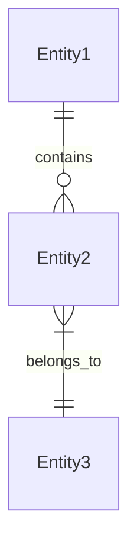
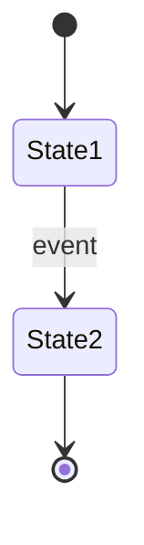

# [Product Name] – Golden Plan

> **Instructions:** Fill in each section. Required fields are marked with *.
> Delete these instruction blocks when done.

---

## A. Domain Definition

### A.1 Product Name *
[Your product name]

### A.2 Tagline
[One-line description of what the product does]

### A.3 Problem Statement
[What problem does this solve? 2-3 sentences about the pain point.]

### A.4 Target Users *
| Persona | Description | Primary Goal |
|---------|-------------|--------------|
| [Name] | [Who they are] | [What they want to achieve] |
| [Name] | [Who they are] | [What they want to achieve] |

### A.5 Key Features
1. [Feature 1]
2. [Feature 2]
3. [Feature 3]

---

## B. Data Model

### B.1 Root Entities *

| Entity | Slug | Description |
|--------|------|-------------|
| [EntityName] | [entity-slug] | [What it represents] |

#### [EntityName] Fields
| Field | Type | Required | Description |
|-------|------|----------|-------------|
| title | string | Yes | Display name |
| status | enum: draft/active/archived | Yes | Current state |
| [field] | [type] | [Yes/No] | [Purpose] |

### B.2 Child Entities

| Entity | Slug | Parent | Description |
|--------|------|--------|-------------|
| [ChildEntity] | [child-slug] | [ParentEntity] | [What it represents] |

### B.3 Relationships


---

## C. User Journeys

### C.1 [Persona] Journey: [Goal]

**Trigger:** [What initiates this journey]

**Steps:**
1. [Action] → [Page/Screen] → [Expected Result]
2. [Action] → [Page/Screen] → [Expected Result]
3. [Action] → [Page/Screen] → [Expected Result]

**Success Criteria:**
- [ ] [Measurable outcome]

**Edge Cases:**
- If [condition], then [behavior]

---

## D. UI Surfaces

### D.1 Route Map *

| Route | Page Name | Persona | States |
|-------|-----------|---------|--------|
| `/` | Landing | All | default |
| `/dashboard` | Dashboard | User | default, loading, empty |
| `/[entity]/:id` | Detail | User | default, not-found |

### D.2 Page Specifications

#### [Page Name]
- **Route:** `/path`
- **Mockup File:** `mockups/page-name.html`
- **States:** default, loading, empty, error

**Layout:**
```
┌─────────────────────────────────────┐
│ Header                               │
├─────────────────────────────────────┤
│ Main Content                         │
└─────────────────────────────────────┘
```

**CTAs:**
| CTA ID | Label | Action | Target |
|--------|-------|--------|--------|
| [cta-id] | [Button text] | navigate/save/enqueueJob | [target] |

**Data Bindings:**
| Element | Source | Entity.Field |
|---------|--------|--------------|
| Title | context | Entity.title |

---

## E. AI Jobs & Prompts

> **Note:** Skip this section if your app has no AI features.

### E.1 Job Registry

| Job ID | Target Entity | Mode | Trigger |
|--------|---------------|------|---------|
| [job_id] | [Entity] | sync/async | [Button/Event] |

### E.2 Job Specifications

#### [job_id]
- **Target Entity:** [Entity]
- **Execution Mode:** synchronous | async
- **UI Placement:** [Where the trigger appears]

**Input Schema:**
```typescript
{
  entity_id: string;
}
```

**Prompt Template:**
```
You are a [role]. Given the following context:
- {{field1}}

[Instructions]

Return JSON:
{
  "result": ...
}
```

**Output Schema:**
```typescript
{
  result: string;
}
```

---

## F. Business Logic Specifications

> **Note:** Skip subsections that don't apply to your app.

### F.1 State Machines

#### [Feature] State Machine


**States:**
| State | Description | Entry Condition |
|-------|-------------|-----------------|
| State1 | [description] | [how we get here] |

**Transitions:**
| From | To | Event | Side Effects |
|------|-----|-------|--------------|
| State1 | State2 | [trigger] | [what happens] |

### F.2 Algorithms

#### [Algorithm Name]
**Purpose:** [What it does]

**Pseudocode:**
```
INPUT: [parameters]
OUTPUT: [result]

1. [Step]
2. IF [condition]:
     [action]
3. RETURN [result]
```

**Edge Cases:**
- [Case]: [Handling]

### F.3 Computed Properties

| Property | Formula | Used In |
|----------|---------|---------|
| entity.computed | expression | [component] |

### F.4 Client-Side Stores

#### [StoreName]
**Purpose:** [What state it manages]

**Schema:**
```typescript
interface [StoreName]State {
  data: DataType[];
  isLoading: boolean;
  setData: (data: DataType[]) => void;
}
```

**Initial State:**
```typescript
{
  data: [],
  isLoading: false,
}
```

**Actions:**
| Action | Parameters | Effect |
|--------|------------|--------|
| setData | data[] | Updates data array |

### F.5 Validation Rules

| Entity | Field | Rule | Error Message |
|--------|-------|------|---------------|
| [Entity] | title | min 1 char | "Title is required" |

### F.6 Business Rules

| Rule ID | Description | Enforcement |
|---------|-------------|-------------|
| BR-001 | [Rule description] | [Where enforced] |

---

## G. Environment & Secrets

### G.1 Frontend Environment Variables *

| Variable | Required | Default | Description |
|----------|----------|---------|-------------|
| VITE_SUPABASE_URL | Yes | - | Supabase project URL |
| VITE_SUPABASE_PUBLISHABLE_KEY | Yes | - | Public anon key |

### G.2 Backend Environment Variables

| Variable | Required | Default | Description |
|----------|----------|---------|-------------|
| SUPABASE_SERVICE_ROLE_KEY | Yes | - | Service role key |
| OPENAI_API_KEY | If AI | - | For AI jobs |

### G.3 MCP Server Variables

| Variable | Required | Default | Description |
|----------|----------|---------|-------------|
| PORT | No | 4000 | Server port |
| MCP_AUTH_TOKEN | Yes | - | Auth token |

---

## Verification Checklist

Before declaring "done":

### Setup
- [ ] User provided Supabase URL and Anon Key
- [ ] User provided Supabase Access Token (sbp_...)
- [ ] User provided AI API key (if Section E has jobs)

### Build
- [ ] `npx tsx scripts/scaffold-manifest.ts` ran
- [ ] `npx tsx scripts/generate-logic.ts` ran (if Section F present)
- [ ] `npx tsx scripts/compile-mockups.ts` ran

### Verify
- [ ] `npm run typecheck` passes
- [ ] `npm run test` passes
- [ ] `npm run verify` passes

### Deploy
- [ ] Edge Functions deployed
- [ ] Secrets set
- [ ] `npx tsx scripts/verify-live-deployment.ts` passes

---

**Plan Version:** 1.0  
**Created:** [DATE]  
**Author:** [NAME]


