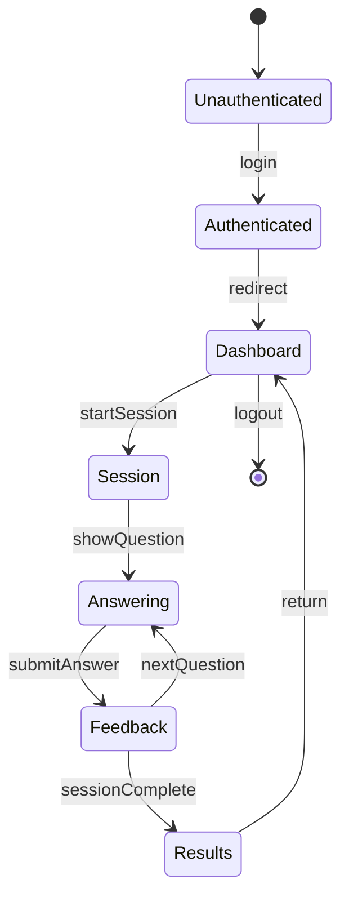

# User Journey: LearnPlay Platform

## Overview
The core user journey for LearnPlay Platform focuses on learners completing adaptive learning sessions while teachers and parents monitor progress through role-specific dashboards.

## Primary Journey: Learner Completes a Session

### Steps

1. **Login** → User authenticates at `/auth` → Redirected to `/student/dashboard`
2. **View Dashboard** → User sees weekly goal progress, current assignment → Clicks "Continue Learning"
3. **Session Welcome** → User sees `/play/welcome` → Session context displayed → Clicks "Start"
4. **Answer Questions** → Adaptive algorithm presents items at `/play` → User selects answers → Immediate feedback
5. **Complete Session** → Pool exhausted → Navigates to `/results` → Score and progress displayed
6. **Return Home** → User clicks "Back to Dashboard" → `/student/dashboard` shows updated goal progress

### Success Metrics
- Session completion rate > 80%
- Average session time < 15 minutes
- Accuracy improvement over 5 sessions

### Edge Cases
- **Network disconnection**: Auto-save progress via session events, resume on reconnect
- **All answers wrong**: Eventually complete via variant rotation (prevents infinite loops)
- **Session timeout**: Save partial progress after 30 minutes of inactivity
- **Browser closed**: Progress saved at each answer, can resume

---

## Secondary Journey: Teacher Assigns Work

### Steps

1. **Login** → Teacher authenticates → Redirected to `/teacher/dashboard`
2. **View Classes** → Teacher sees class overview → Identifies students needing attention
3. **Create Assignment** → Teacher navigates to `/teacher/control` → Fills assignment form
4. **AI Assistance** → Teacher clicks "Draft Plan" → AI suggests activities based on student performance
5. **Review & Assign** → Teacher reviews suggestions → Modifies if needed → Saves assignment
6. **Monitor Progress** → Teacher checks `/teacher/class-progress` → Sees completion rates

### Success Metrics
- Assignment creation time < 5 minutes
- AI suggestion acceptance rate > 70%
- Teacher satisfaction with recommendations

---

## Tertiary Journey: Parent Monitors Child

### Steps

1. **Login** → Parent authenticates → Redirected to `/parent/dashboard`
2. **View Summary** → Parent sees child's weekly progress → KPIs displayed
3. **Explore Details** → Parent navigates to `/parent/subjects` → Per-subject breakdown
4. **Review Activity** → Parent checks `/parent/timeline` → Recent session details
5. **Adjust Goals** → Parent navigates to `/parent/goals` → Modifies weekly target if needed

### Success Metrics
- Parent engagement (weekly login rate > 50%)
- Goal adjustment frequency (indicates engagement)
- Parent understanding of child's progress

---

## State Diagram

---

## Error States

| State | Trigger | Resolution |
|-------|---------|------------|
| Network Error | Connection lost | Show retry button, auto-retry in 5s |
| Session Expired | JWT expired | Redirect to /auth with return URL |
| Course Not Found | Invalid course ID | Show error, link to dashboard |
| AI Job Failed | Backend error | Show manual fallback options |

---

## Accessibility Considerations

1. **Keyboard Navigation**: All CTAs accessible via Tab
2. **Screen Reader**: ARIA labels on interactive elements
3. **Color Contrast**: Minimum 4.5:1 ratio
4. **Motion**: Respect `prefers-reduced-motion`
5. **Focus Indicators**: Visible focus rings on all interactive elements

